* Table of Contents
{:toc}

--------------------------------------------------------------------------------------------------------------------

## **Acknowledgements**

EventWise is based on the [AddressBook-Level3](https://github.com/se-edu/addressbook-level3) project created by the [SE-EDU](https://se-education.org/) initiative as part of the [CS2103/T Software Engineering](https://nus-cs2103-ay2324s1.github.io/website/) module by the School of Computing, National University of Singapore.

Java libraries used in this project:
- [Jackson](https://github.com/FasterXML/jackson) for Storage
- [JavaFX](https://openjfx.io/) for GUI
- [JUnit5](https://junit.org/junit5/) for Testing

Reused / Adapted Ideas
- [Date Validation Format](https://stackoverflow.com/questions/15491894/) from StackOverflow

## **Setting up, getting started**

:bulb: If you are interested in testing out EventWise, you can refer to our [quick start](./UserGuide.md#quick-start) in the user guide.

If you are interested in contributing to EventWise, you can find the project setup steps below.

### Set up the project locally
1. Create a fork of the GitHub repository.
2. Clone your fork of the repository into a local directory.
3. Build the project.
4. Run the project.

### Make your contribution
1. Create a local branch for a feature/fix/enhancement.
2. Make changes and push them to your fork.
3. Create a pull request to the original repository.

## **Terminology**

| Term     | Meaning                                                                                                                                                                                     |
|----------|---------------------------------------------------------------------------------------------------------------------------------------------------------------------------------------------|
| Attendee | An individual who participates in an event, typically as a guest. In the Developer Guide, we use the terms "Attendee", "Guest" and "Person" interchangably as they refer to the same thing. |
| Vendor   | A company or individual that provides goods, services or exhibits at an event                                                                                                               |

--------------------------------------------------------------------------------------------------------------------
## **Design**

:bulb: **Tip:** The `.puml` files used to create diagrams in this document `docs/diagrams` folder. Refer to the [_PlantUML Tutorial_ at se-edu/guides](https://se-education.org/guides/tutorials/plantUml.html) to learn how to create and edit diagrams.

### Architecture

The ***Architecture Diagram*** given above explains the high-level design of the App.

Given below is a quick overview of main components and how they interact with each other.

**Main components of the architecture**

**`Main`** (consisting of classes [`Main`](https://github.com/se-edu/addressbook-level3/tree/master/src/main/java/seedu/address/Main.java) and [`MainApp`](https://github.com/se-edu/addressbook-level3/tree/master/src/main/java/seedu/address/MainApp.java)) is in charge of the app launch and shut down.
* At app launch, it initializes the other components in the correct sequence, and connects them up with each other.
* At shut down, it shuts down the other components and invokes cleanup methods where necessary.

The bulk of the app's work is done by the following four components:

* [**`UI`**](#ui-component): The UI of the App.
* [**`Logic`**](#logic-component): The command executor.
* [**`Model`**](#model-component): Holds the data of the App in memory.
* [**`Storage`**](#storage-component): Reads data from, and writes data to, the hard disk.

[**`Commons`**](#common-classes) represents a collection of classes used by multiple other components.

**How the architecture components interact with each other**

The *Sequence Diagram* below shows how the components interact with each other for the scenario where the user issues the command `delete 1`.

Each of the four main components (also shown in the diagram above),

* defines its *API* in an `interface` with the same name as the Component.
* implements its functionality using a concrete `{Component Name}Manager` class (which follows the corresponding API `interface` mentioned in the previous point.

For example, the `Logic` component defines its API in the `Logic.java` interface and implements its functionality using the `LogicManager.java` class which follows the `Logic` interface. Other components interact with a given component through its interface rather than the concrete class (reason: to prevent outside component's being coupled to the implementation of a component), as illustrated in the (partial) class diagram below.

The sections below give more details of each component.

### UI component

The **API** of this component is specified in [`Ui.java`](https://github.com/se-edu/addressbook-level3/tree/master/src/main/java/seedu/address/ui/Ui.java)

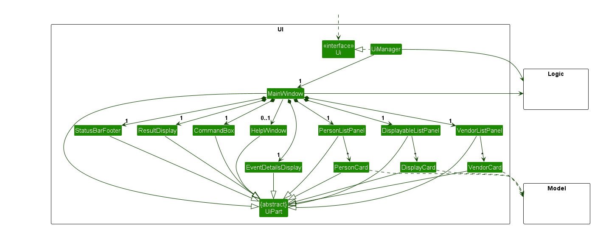

The UI consists of a `MainWindow` that is made up of parts e.g.`CommandBox`, `ResultDisplay`, `PersonListPanel`, `StatusBarFooter` etc. All these, including the `MainWindow`, inherit from the abstract `UiPart` class which captures the commonalities between classes that represent parts of the visible GUI.

The `UI` component uses the JavaFx UI framework. The layout of these UI parts are defined in matching `.fxml` files that are in the `src/main/resources/view` folder. For example, the layout of the [`MainWindow`](https://github.com/se-edu/addressbook-level3/tree/master/src/main/java/seedu/address/ui/MainWindow.java) is specified in [`MainWindow.fxml`](https://github.com/se-edu/addressbook-level3/tree/master/src/main/resources/view/MainWindow.fxml)

The `UI` component,

* executes user commands using the `Logic` component.
* listens for changes to `Model` data so that the UI can be updated with the modified data.
* keeps a reference to the `Logic` component, because the `UI` relies on the `Logic` to execute commands.
* depends on some classes in the `Model` component, as it displays `Person` object residing in the `Model`.

### Logic component

**API** : [`Logic.java`](https://github.com/se-edu/addressbook-level3/tree/master/src/main/java/seedu/address/logic/Logic.java)

Here's a (partial) class diagram of the `Logic` component:

The sequence diagram below illustrates the interactions within the `Logic` component, taking `execute("delete 1")` API call as an example.

:information_source: **Note:** The lifeline for `DeleteCommandParser` should end at the destroy marker (X) but due to a limitation of PlantUML, the lifeline reaches the end of diagram.

How the `Logic` component works:

1. When `Logic` is called upon to execute a command, it is passed to an `AddressBookParser` object which in turn creates a parser that matches the command (e.g., `DeleteCommandParser`) and uses it to parse the command.
1. This results in a `Command` object (more precisely, an object of one of its subclasses e.g., `DeleteCommand`) which is executed by the `LogicManager`.
1. The command can communicate with the `Model` when it is executed (e.g. to delete a person).
1. The result of the command execution is encapsulated as a `CommandResult` object which is returned back from `Logic`.

Here are the other classes in `Logic` (omitted from the class diagram above) that are used for parsing a user command:

How the parsing works:
* When called upon to parse a user command, the `AddressBookParser` class creates an `XYZCommandParser` (`XYZ` is a placeholder for the specific command name e.g., `AddCommandParser`) which uses the other classes shown above to parse the user command and create a `XYZCommand` object (e.g., `AddCommand`) which the `AddressBookParser` returns back as a `Command` object.
* All `XYZCommandParser` classes (e.g., `AddCommandParser`, `DeleteCommandParser`, ...) inherit from the `Parser` interface so that they can be treated similarly where possible e.g, during testing.

### Model component
**API** : [`Model.java`](https://github.com/se-edu/addressbook-level3/tree/master/src/main/java/seedu/address/model/Model.java)

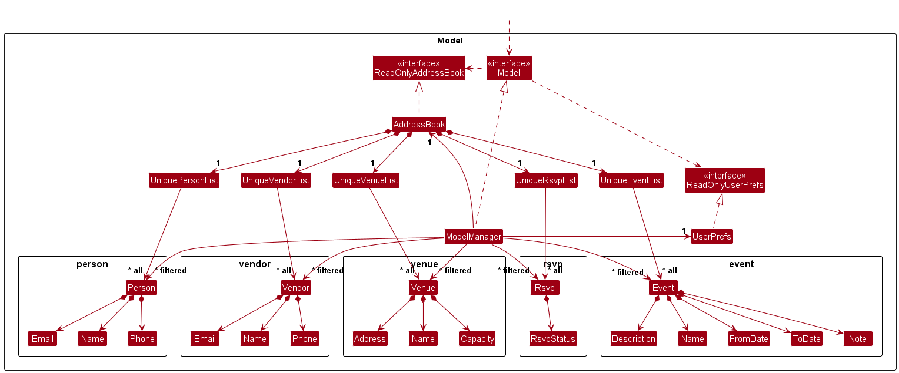

The `Model` component,

* stores the address book data i.e., all `Person` objects (which are contained in a `UniquePersonList` object).
* stores the currently 'selected' `Person` objects (e.g., results of a search query) as a separate _filtered_ list which is exposed to outsiders as an unmodifiable `ObservableList<Person>` that can be 'observed' e.g. the UI can be bound to this list so that the UI automatically updates when the data in the list change.
* stores a `UserPref` object that represents the user’s preferences. This is exposed to the outside as a `ReadOnlyUserPref` objects.
* does not depend on any of the other three components (as the `Model` represents data entities of the domain, they should make sense on their own without depending on other components)

:information_source: **Note:** An alternative (arguably, a more OOP) model is given below. It has a `Tag` list in the `AddressBook`, which `Person` references. This allows `AddressBook` to only require one `Tag` object per unique tag, instead of each `Person` needing their own `Tag` objects. 

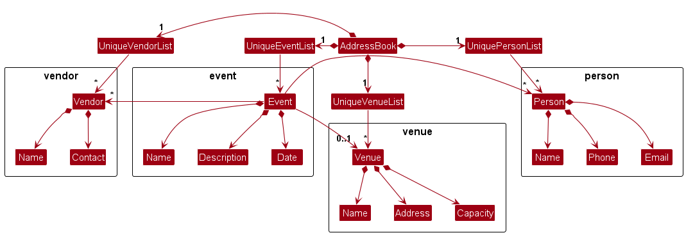

### Storage component

**API** : [`Storage.java`](https://github.com/se-edu/addressbook-level3/tree/master/src/main/java/seedu/address/storage/Storage.java)

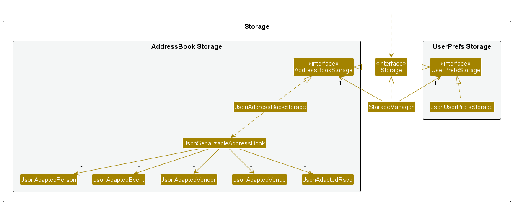

The `Storage` component,
* can save both address book data and user preference data in JSON format, and read them back into corresponding objects.
* inherits from both `AddressBookStorage` and `UserPrefStorage`, which means it can be treated as either one (if only the functionality of only one is needed).
* depends on some classes in the `Model` component (because the `Storage` component's job is to save/retrieve objects that belong to the `Model`)

### Common classes

Classes used by multiple components are in the `seedu.addressbook.commons` package.

--------------------------------------------------------------------------------------------------------------------

## **Implementation**

This section describes some noteworthy details on how certain features are implemented.

### Create new Person/Event/Vendor/Venue Feature

In EventWise, users are able to create a new person, event, vendor and venue instance and are stored in storage.

#### Create a new Person

The feature `add` creates a new `Person` instance. Details that must be provided includes `Name`, `Phone` and `Email`.

##### Implementation

The sequence diagram for the `add` command is given below.

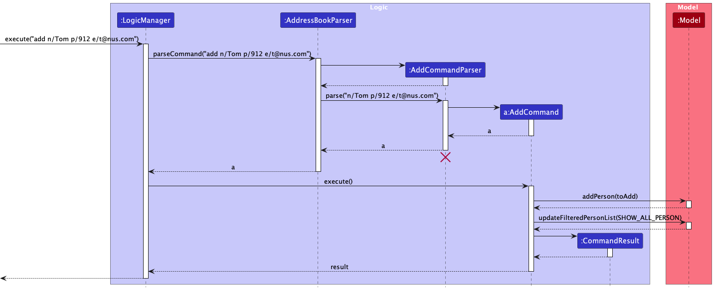

1. The `LogicManager` receives an input string to execute. For example, using the sequence diagram above,
it receives `add n/Tom p/912 e/t@nus.com`
2. The `LogicManager` then sends the input string to `AddressBookParser`
3. The `AddressBookParser` then validate the input string and create a new `AddCommandParser` instance
4. The `AddressBookParser` then parse the name, phone and email of the user input. In this example, `n/Tom p/912 e/t@nus.com` is the parameter parsed to `AddCommandParser`
5. The `AddCommandParser` then creates a new Person instance and creates a `AddCommand` object with the newly created `Person` object
6. This `AddCommand` is then passed back to `LogicManager`
7. The `LogicManager` then calls the `execute` method in `AddCommand`
8. The `AddCommand` then interacts with the `Model` instance to add the `Person` object to storage
9. After adding the `Person` object, the `Model` update the filtered person list which updates the GUI to display the newly created `Person` object
10. Lastly, The `AddCommand` creates a `CommandResult` instance and return it to `LogicManager` to display success message

#### Create a new Event

The feature `event` creates a new `Event` instance. Details that must be provided includes `Name`, `Description`, `FromDate` and `ToDate` and an optional `Note`.

##### Implementation

The sequence diagram for the `event` command is similar to the `add` command. Hence, we will be referring to the sequence diagram of the `add` command.
The difference between the `add` and `event` implementation is:
1. An example of the user input for `event` is `event n/FSC 2023 d/Freshman Social Camp 2023 from/11-12-2023 to/13-12-2023 no/Food and Drinks provided`
2. Instead of `AddCommandParser`, it will be replaced with `CreateEventCommandParser`
3. Instead of `AddCommand`, it will be replaced with `CreateEventCommand`
4. Instead of parsing the name, phone and email of the user input, the name, description, from date, to date and the optional note will be parsed.
5. Instead of creating and adding the `Person` object, it will be replaced with `Event` object
6. Instead of the `Model` updating the filtered person list, the `Model` updates the filtered event list instead

#### Create a new Vendor

The feature `vendor` creates a new `Vendor` instance. Details that must be provided includes `Name`, `Phone`, `Email`.

##### Implementation

The sequence diagram for the `vendor` command is similar to the `add` command. Hence, we will be referring to the sequence diagram of the `add` command.
The difference between the `add` and `vendor` implementation is:
1. An example of the user input for `vendor` is `vendor n/SUN Catering p/64226800 e/catering@sun.com`
2. Instead of `AddCommandParser`, it will be replaced with `CreateVendorCommandParser`
3. Instead of `AddCommand`, it will be replaced with `CreateVendorCommand`
4. In this case, the details that will be parsed from the user input will be the same, which is the name, phone and email
5. Instead of creating and adding the `Person` object, it will be replaced with `Vendor` object
6. Instead of the `Model` updating the filtered person list, the `Model` updates the filtered vendor list instead

#### Create a new Venue

The feature `venue` creates a new `Venue` instance. Details that must be provided includes `Name`, `Address`, `Capacity`.

##### Implementation

The sequence diagram for the `venue` command is similar to the `add` command. Hence, we will be referring to the sequence diagram of the `add` command.
The difference between the `add` and `venue` implementation is:
1. An example of the user input for `venue` is `venue n/MPSH 1 a/Multipurpose Sports Hall 1, Sports and Recreation Centre, 119077 c/500`
2. Instead of `AddCommandParser`, it will be replaced with `CreateVenueCommandParser`
3. Instead of `AddCommand`, it will be replaced with `CreateVenueCommand`
4. Instead of parsing the name, phone and email of the user input, the name, address and capacity will be parsed.
5. Instead of creating and adding the `Person` object, it will be replaced with `Venue` object
6. Instead of the `Model` updating the filtered person list, the `Model` updates the filtered venue list instead

### Edit Person Feature

The feature `edit` edits the details of an existing Person instance.
Details that can be edited include `Name`, `Phone`, `Email`.

#### Implementation

`LogicManager` calls `AddressBookParser` which creates an instance of `EditCommandParser` to parse user inputs.
An instance of `EditCommand` is created from parsing the user inputs, which is then executed by `LogicManager`.
The `Person` instance is successfully edited, and is stored in `Storage`.

The following activity diagram shows how this feature works:

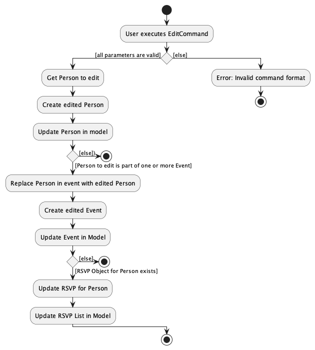

The following sequence diagram shows how this feature works:

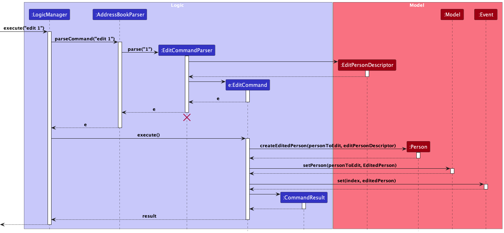

### Edit Vendor Feature

The feature `editVendor` edits the details of an existing Vendor instance.
Details that can be edited include `Name`, `Phone`, `Email`.

#### Implementation

`LogicManager` calls `AddressBookParser` which creates an instance of `EditVendorCommandParser` to parse user inputs.
An instance of `EditVendorCommand` is created from parsing the user inputs, which is then executed by `LogicManager`.
The `Vendor` instance is successfully edited, and is stored in `Storage`.

The following activity diagram shows how this feature works:

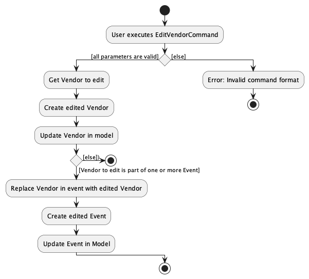

The following sequence diagram shows how this feature works:

### Edit Venue Feature

The feature `editVenue` edits the details of an existing Venue instance.
Details that can be edited include `Name`, `Address`, `Capacity`.

#### Implementation

`LogicManager` calls `AddressBookParser` which creates an instance of `EditVenueCommandParser` to parse user inputs.
An instance of `EditVenueCommand` is created from parsing the user inputs, which is then executed by `LogicManager`.
The `Venue` instance is successfully edited, and is stored in `Storage`.

The following activity diagram shows how this feature works:

The following sequence diagram shows how this feature works:

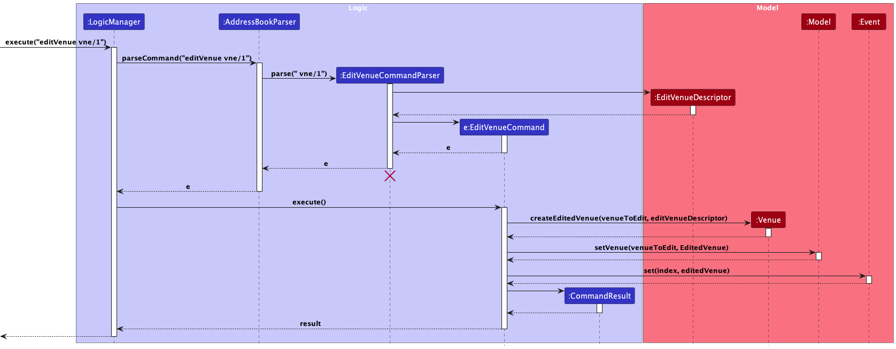

### Edit Event Feature

The feature `editEvent` edits the details of an existing Event instance.
Details that can be edited include `Name`, `Description`, `From Date`, `To Date`, `Note`.

#### Implementation

`LogicManager` calls `AddressBookParser` which creates an instance of `EditEventCommandParser` to parse user inputs.
An instance of `EditEventCommand` is created from parsing the user inputs, which is then executed by `LogicManager`.
The `Event` instance is successfully edited, and is stored in `Storage`.

The following activity diagram shows how this feature works:

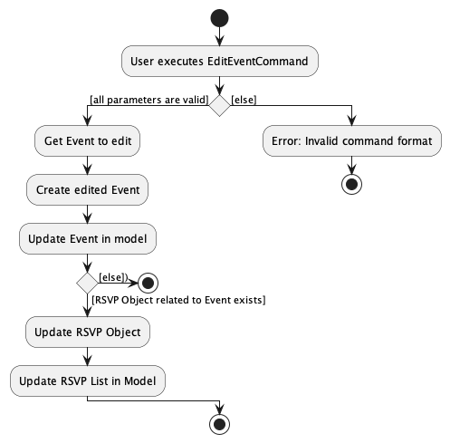

The following sequence diagram shows how this feature works:

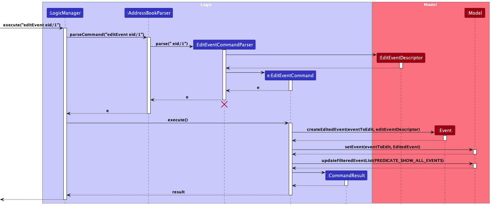

### Delete Person Feature

The feature `delete` deletes an existing Person instance.

#### Implementation

`LogicManager` calls `AddressBookParser` which creates an instance of `DeleteCommandParser` to parse user inputs.
An instance of `DeleteCommand` is created from parsing the user inputs, which is then executed by `LogicManager`.
The `Person` instance is successfully deleted, and removed from `Storage`.

The following activity diagram shows how this feature works:

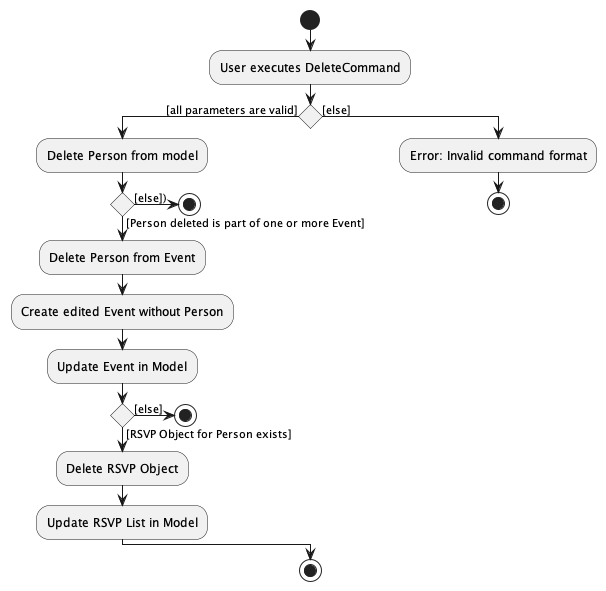

The following sequence diagram shows how this feature works:

### Delete Vendor Feature

The feature `deleteVendor` deletes an existing Vendor instance.

#### Implementation

`LogicManager` calls `AddressBookParser` which creates an instance of `DeleteVendorCommandParser` to parse user inputs.
An instance of `DeleteVendorCommand` is created from parsing the user inputs, which is then executed by `LogicManager`.
The `Vendor` instance is successfully deleted, and removed from `Storage`.

The following activity diagram shows how this feature works:

The following sequence diagram shows how this feature works:

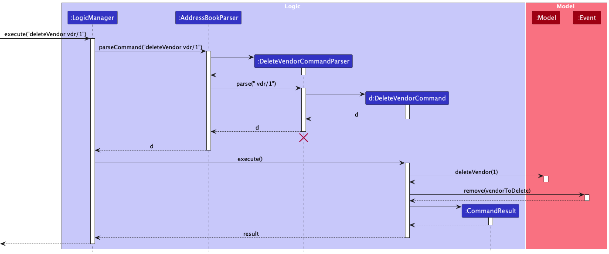

### Delete Venue Feature

The feature `deleteVenue` deletes an existing Venue instance.

#### Implementation

`LogicManager` calls `AddressBookParser` which creates an instance of `DeleteVenueCommandParser` to parse user inputs.
An instance of `DeleteVenueCommand` is created from parsing the user inputs, which is then executed by `LogicManager`.
The `Venue` instance is successfully deleted, and removed from `Storage`.

The following activity diagram shows how this feature works:

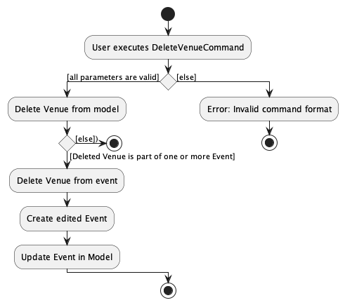

The following sequence diagram shows how this feature works:

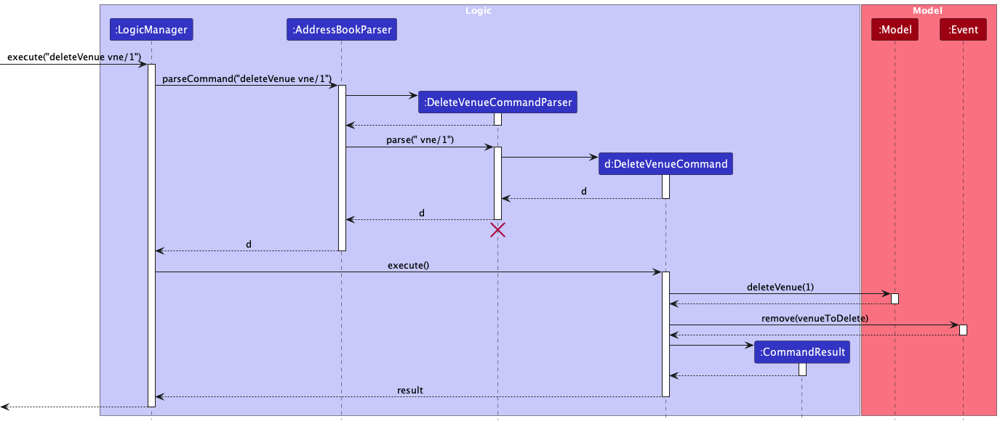

### Delete Event Feature

The feature `deleteEvent` deletes an existing Event instance.

#### Implementation

`LogicManager` calls `AddressBookParser` which creates an instance of `DeleteEventCommandParser` to parse user inputs.
An instance of `DeleteEventCommand` is created from parsing the user inputs, which is then executed by `LogicManager`.
The `Event` instance is successfully deleted, and removed from `Storage`.

The following activity diagram shows how this feature works:

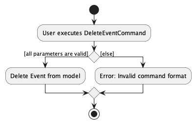

The following sequence diagram shows how this feature works:

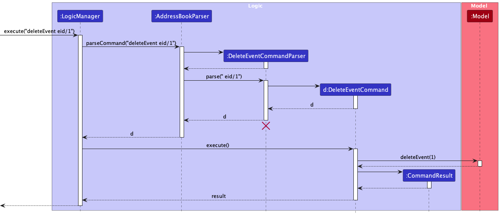

### View All Persons Feature

The feature `list` lists all existing Person instances.

#### Implementation

`LogicManager` calls `AddressBookParser` which creates an instance of `ListCommand`, which is then executed by `LogicManager`.
All `Person` instances are then listed.

### View All Vendors Feature

The feature `viewVendors` lists all existing Vendor instances.

#### Implementation

`LogicManager` calls `AddressBookParser` which creates an instance of `ViewVendorsCommand`, which is then executed by `LogicManager`.
All `Vendor` instances are then listed.

### View All Venues Feature

The feature `viewVenues` lists all existing Venue instances.

#### Implementation

`LogicManager` calls `AddressBookParser` which creates an instance of `ViewVenuesCommand`, which is then executed by `LogicManager`.
All `Venue` instances are then listed.

### View All Events Feature

The feature `viewEvents` lists all existing Event instances.

#### Implementation

`LogicManager` calls `AddressBookParser` which creates an instance of `ViewEventsCommand`, which is then executed by `LogicManager`.
All `Event` instances are then listed.

### View specific event Feature

Viewing a specific event is a feature that uses the command `viewEvent eid/EVENT_ID`.

The format for this command can be seen [here](./UserGuide.md#displaying-details-for-an-event-viewevent).

It is used to view detailed information relating to an existing `Event` in EventWise such as the event's `Venue` information, a list of `Person` objects and a list of `Vendor` objects that are part of the specific event.

#### Implementation

`LogicManager` calls `AddressBookParser` which creates an instance of a `ViewEventCommandParser` to parse user inputs. An instance of `ViewEventCommand` is created from parsing the user inputs, which is then executed by `LogicManager`. The `Event` instance is set as the event to be displayed in `Model`. `MainWindow` calls `Logic` to get the `Event` instance from `Model` after the `CommandResult` from executing the `ViewEventCommand` has been shown to the user.

### Add Event Details Feature

The command `addEventDetails eid/EVENT_ID [pid/INDEX] [vdr/VENDOR_ID] [vne/VENUE_ID]` allows the user to add event details such as venue, guests and vendors to a specified event in EventWise.

The format for this command can be seen [here](./UserGuide.md#adding-details-to-an-event-addeventdetails).

#### Implementation
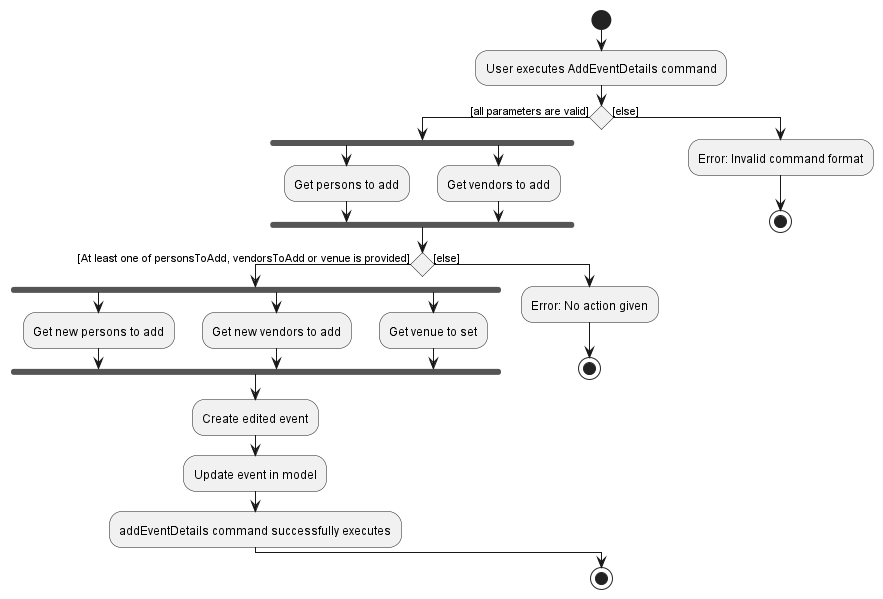

`LogicManager` calls `AddressBookParser` which creates an instance of a `AddEventDetailsCommandParser` to parse user inputs.

The `AddEventDetailsCommandParser` parses the user input into
* `personIndexes` and `vendorIndexes` which are two `HashSet<Index>` objects storing multiple people or vendor indexes.
* `venueIndex` representing the venue index displayed in the Main List.

An instance of `AddEventDetailsCommand` is created from the parsed user inputs `personIndexes`, `vendorIndexes` and `venueIndex`, which is then executed by `LogicManager`.

The `Event` instance is set as the event to be displayed in `Model`. `MainWindow` calls `Logic` to get the `Event` instance from `Model` after the `CommandResult` from executing the `ViewEventCommand` has been shown to the user.

#### Remarks
In our Developer Guide, we have decided to split it into **three** smaller subfeatures to explain their command execution and implementation details.
1. Add Person to Event
2. Add Vendor to Event
3. Set Venue to Event

### Add Person to Event Subfeature

Adding a person to a specific event is a subfeature of the `addEventDetails` command which uses the `[pid/INDEX]` field. It can be repeated more than once to add multiple people.

#### Implementation
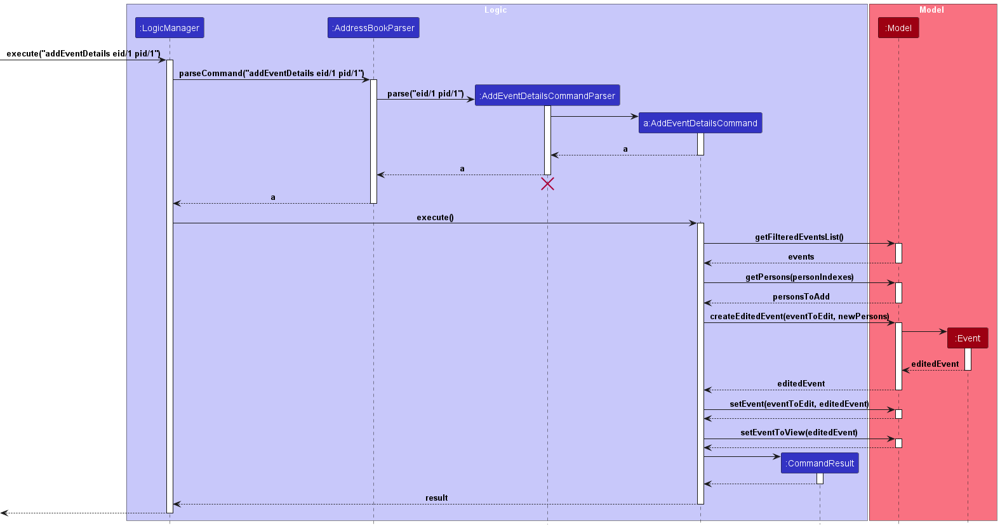

* When the `AddEventDetailsCommand` is executed by `LogicManager`. The `AddEventDetailsCommand` instance calls the `Model` to get a list of events before making another call to get all person instances to be added to the event.

* `Model#getPersons(personIndexes)` will handle cases where the person index is invalid (less than 0 or more than number of persons)

* A new `Event` instance, `editedEvent` is created by `Model` and returned to the `AddEventDetailsCommand`. `AddEventDetailsCommand` will then call `Model#setEvent(eventToEdit, editedEvent)` to update the modified event instance.

* Finally, the `editedEvent` is set as the event to be displayed in `Model`.

### Add Vendor to Event Subfeature

Adding a vendor to a specific event is subfeature of the `addEventDetails` command which uses the `[vdr/VENDOR_ID]` field. It can be repeated more than once to add multiple people.

#### Implementation

* When the `AddEventDetailsCommand` is executed by `LogicManager`. The `AddEventDetailsCommand` instance calls the `Model` to get a list of events before making another call to get all vendor instances to be added to the event.

* `Model#getVendors(vendorIndexes)` will handle cases where the vendor index is invalid (less than 0 or more than number of vendors)

* A new `Event` instance, `editedEvent` is created by `Model` and returned to the `AddEventDetailsCommand`. `AddEventDetailsCommand` will then call `Model#setEvent(eventToEdit, editedEvent)` to update the modified event instance.

* Finally, the `editedEvent` is set as the event to be displayed in `Model`.

### Set Venue to Event Subfeature

Setting a venue to a specific event is subfeature of the `addEventDetails` command which uses the `[vne/VENUE_ID]` field.

#### Implementation
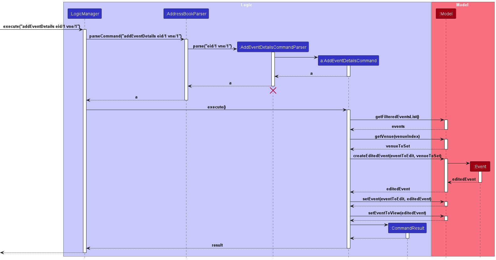

* When the `AddEventDetailsCommand` is executed by `LogicManager`. The `AddEventDetailsCommand` instance calls the `Model` to get a list of events before making another call to get the venue instance to be set as the event's venue.

* `Model#getVenue(venueIndex)` will handle cases where the venue index is invalid (less than 0 or more than number of vendors).

* A new `Event` instance, `editedEvent` is created by `Model` and returned to the `AddEventDetailsCommand`. `AddEventDetailsCommand` will then call `Model#setEvent(eventToEdit, editedEvent)` to update the modified event instance.

* Finally, the `editedEvent` is set as the event to be displayed in `Model`.

### Remove Person from Event Feature

Removing a person from an event is a feature that uses the command `removePerson eid/EVENT_ID pid/PERSON_ID`.

The format for this command can be seen [here](./UserGuide.md#removing-a-person-from-an-event-removeperson).

#### Implementation
The following activity diagram shows how the `removePerson` command works when given valid parameters or invalid parameters (`EVENT_ID` or `PERSON_ID`) are given.

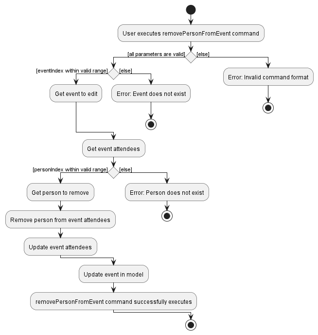

The sequence diagram for the `removePerson` command is given below.

`LogicManager` calls `AddressBookParser` which creates an instance of a `RemoveVendorCommandParser` to parse user inputs. An instance of `RemovePersonCommand` is created from parsing the user inputs, which is then executed by `LogicManager`.

When `RemovePersonCommand#execute()` is called, `RemovePersonCommand` calls `Model` to get the `Event` instance to edit. `RemovePersonCommand` then calls the `Event` instance to remove the person from the event by passing `personIndex`.
Finally, `RemovePersonCommand` calls the `Model` instance to update the edited `Event` instance before creating a `CommandResult` to be shown to the user.

### Remove Vendor from Event Feature

Removing a vendor from an event is a feature that uses the command `removeVendor eid/EVENT_ID vdr/VENDOR_ID`.

The format for this command can be seen [here](./UserGuide.md#removing-a-vendor-from-an-event-removevendor).

#### Implementation
The sequence diagram for the `removeVendor` command is given below.

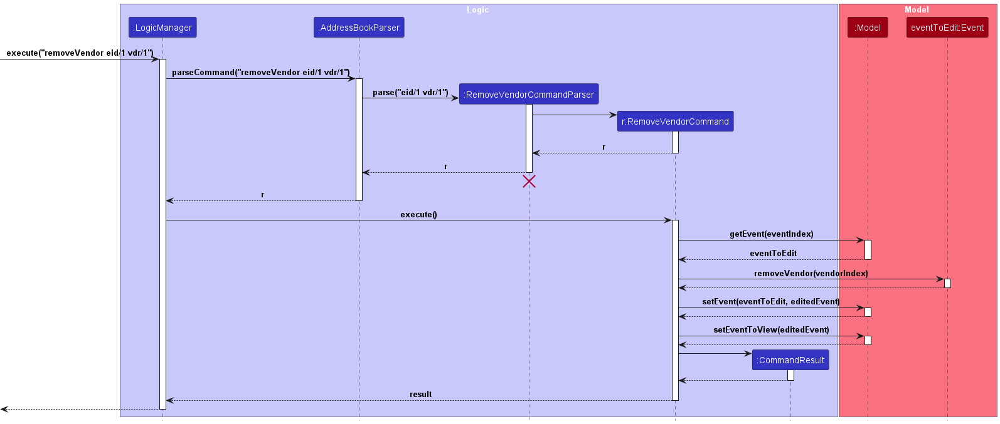

`LogicManager` calls `AddressBookParser` which creates an instance of a `RemoveVendorCommandParser` to parse user inputs. An instance of `RemoveVendorCommand` is created from parsing the user inputs, which is then executed by `LogicManager`.

When `RemoveVendorCommand#execute()` is called, `RemoveVendorCommand` calls `Model` to get the `Event` instance to edit. `RemoveVendorCommand` then calls the `Event` instance to remove the vendor from the event by passing `vendorIndex`.
Finally, `RemoveVendorCommand` calls the `Model` instance to update the edited `Event` instance before creating a `CommandResult` to be shown to the user.

### Find event Feature

Finding events by name is a feature that uses the command `findEvent KEYWORD [MORE_KEYWORDS]`.

The format for this command can be seen [here](./UserGuide.md#locating-events-by-name-findevent).

#### Implementation

`LogicManager` calls `AddressBookParser` which creates an instance of a `FindEventCommandParser` to parse user inputs into an array of keywords. An instance of `FindEventCommand` is created, which is then executed by `LogicManager`.

All `Event` instances whose names match the keywords are then listed.

### RSVP feature

In EventWise, users are able to set the RSVP status to indicate their attendance after being added to an event. The feature `rsvp` sets a creates a new `Rsvp` instance. In each `rsvp` instance, it stores the `Person` object, the `Event` object as well as the `RSVP_Status`.

#### Implementation

The following activity diagram shows how the `rsvp` command works when given valid parameters or invalid parameters (`EVENT_ID`, `PERSON_ID` or `RSVP_STATUS`) are given.

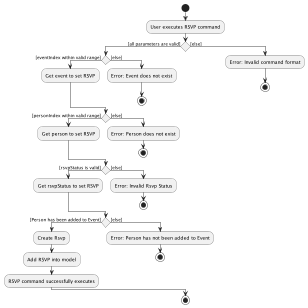

The sequence diagram for the `rsvp` command is given below.

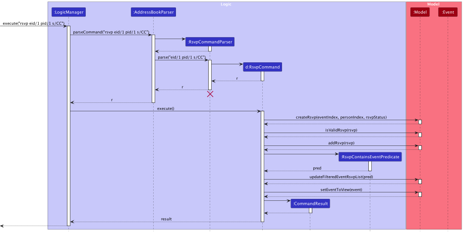

1. The `LogicManager` receives an input string to execute. For example, using the sequence diagram above,
   it receives `rsvp eid/1 pid/1 s/CC`
2. The `LogicManager` then sends the input string to `AddressBookParser`
3. The `AddressBookParser` then validate the input string and create a new `RsvpCommandParser` instance
4. The `AddressBookParser` then parse the `Event ID`, `Person ID` and `RSVP_Status` of the user input. In this example, `eid/1 pid/1 s/CC` is the parameter parsed to `RsvpCommandParser`
5. The `RsvpCommandParser` then creates a `RSVPCommand` instance with the `Index` value of the `Event_ID` and `Person_ID`. It also provided the `RsvpStatus` object
6. This `RsvpCommand` is then passed back to `LogicManager`
7. The `LogicManager` then calls the `execute` method in `RsvpCommand`
8. The `RsvpCommand` then interacts with the `Model` instance to create a new `Rsvp` object.
9. The `RsvpCommand` then check whether the `Rsvp` object is valid by checking if the `Person` is attending the `Event`
10. The `RsvpCommand` then interacts with the `Model` instance again to add the `Rsvp` object to storage
11. After adding the `Rsvp` object, the `Model` update the filtered RSVP list which updates the GUI to display the newly created `Rsvp` object
12. Lastly, The `RsvpCommand` creates a `CommandResult` instance and return it to `LogicManager` to display success message

### Clear all Data/Person/Event/Vendor/Venue Feature

In EventWise, users are able to delete all entries in storage and also have the option to delete all entries of `Person`, `Event`, `Vendor`, or `Venue`

#### Clear all Data

The feature `clear` clears all entries in storage

##### Implementation

1. The `LogicManager` receives an input string, `clear` to execute
2. The `LogicManager` then sends the input string to `AddressBookParser`
3. The `AddressBookParser` then validate the input string and create a new `ClearCommand` instance
4. The `LogicManager` then calls the `execute` method in `ClearCommand`
5. The `ClearCommand` then interacts with the `Model` instance to create a new empty storage.
6. Lastly, The `ClearCommand` creates a `CommandResult` instance and return it to `LogicManager` to display success message

#### Clear all Persons

The feature `clearGuests` clears all `Person` entries in storage

##### Implementation

The implementation of `clearGuests` is similar to `clear`. The difference are:
1. The user input string is `clearGuests` instead of `clear`
2. The `AddressBookParser` creates a new `ClearGuestsCommand` instead of `ClearCommand`
3. The `ClearGuestsComand` interacts with the `Model` instance to create a new and empty `ArrayList` of type `Person`

#### Clear all Events

The feature `clearEvents` clears all `Event` entries in storage

##### Implementation

The implementation of `clearEvents` is similar to `clear`. The difference are:
1. The user input string is `clearEvents` instead of `clear`
2. The `AddressBookParser` creates a new `ClearEventsCommand` instead of `ClearCommand`
3. The `ClearEventsCommand` interacts with the `Model` instance to create a new and empty `ArrayList` of type `Event`

#### Clear all Vendors

The feature `clearVendors` clears all `Vendor` entries in storage

##### Implementation

The implementation of `clearVendors` is similar to `clear`. The difference are:
1. The user input string is `clearVendors` instead of `clear`
2. The `AddressBookParser` creates a new `ClearVendorsCommand` instead of `ClearCommand`
3. The `ClearVendorsCommand` interacts with the `Model` instance to create a new and empty `ArrayList` of type `Vendor`

#### Clear all Venues

The feature `clearVenues` clears all `Venue` entries in storage

##### Implementation

The implementation of `clearVenues` is similar to `clear`. The difference are:
1. The user input string is `clearVenues` instead of `clear`
2. The `AddressBookParser` creates a new `ClearVenuesCommand` instead of `ClearCommand`
3. The `ClearVenuesCommand` interacts with the `Model` instance to create a new and empty `ArrayList` of type `Venue`

--------------------------------------------------------------------------------------------------------------------

## **Documentation, logging, testing, configuration, dev-ops**

* [Documentation guide](Documentation.md)
* [Testing guide](Testing.md)
* [Logging guide](Logging.md)
* [Configuration guide](Configuration.md)
* [DevOps guide](DevOps.md)

--------------------------------------------------------------------------------------------------------------------

## **Appendix: Requirements**

### Product scope

**Target user profile**:

* student event planners
* has a need to manage a significant number of events with many guests and logistics to keep track of, as well as vendors to coordinate.
* can type fast
* is reasonably comfortable using CLI apps

**Value proposition**: provides a platform that allows all event-specific contacts, including management, attendees, vendors, and venue details to be consolidated in one place. It allows event planners to easily track and access their crucial information in a single app, simplifying event coordination and communication for various kinds of events.

### User stories

Priorities: High (must have) - `* * *`, Medium (nice to have) - `* *`, Low (unlikely to have) - `*`

| Priority | As a …​       | I want to …​                                                    | So that I can…​                                                                |
|----------|---------------|-----------------------------------------------------------------|--------------------------------------------------------------------------------|
| `* * *`  | event planner | create a new event, specifying its fromDate, time, and location | keep track of the event details                                                |
| `* * *`  | event planner | create a new vendor, specifying its name, email, and phone      | record down vendors I am working with                                          |
| `* * *`  | event planner | create a new venue, specifying its name, address and capacity   | know which venue is suitable for each event                                    |
| `* * *`  | event planner | add my guest’s contact information to the event                 | know who the event is for and how to reach the guest                           |
| `* * *`  | event planner | add my vendor's information to the event                        | know which vendors are involved in the specified event and how to contact them |
| `* * *`  | event planner | add my venue’s information to the event                         | know where the event will be held at                                           |
| `* * *`  | event planner | add each guest's RSVP status to an event's guest list           | know which guests will be attending the event                                  |
| `* * *`  | event planner | remove a guest from an event                                    | remove guests that I have mistakenly added                                     |
| `* * *`  | event planner | remove a vendor from an event                                   | remove vendors who are unable to commit for the event                          |
| `* * *`  | event planner | view the list of the events created                             | know what event to prepare for                                                 |
| `* * *`  | event planner | view the list of vendors created                                | keep track of the vendors that I am working with                               |
| `* * *`  | event planner | view the list of venues created                                 | keep track of the venues that I created                                        |
| `* * *`  | event planner | view the event details of a specific event                      | prepare for that specific event                                                |
| `* * *`  | event planner | delete an existing event                                        | be more attentive to valid events                                              |
| `* *`    | event planner | delete an existing vendor                                       | remove vendors who I am not working with                                       |
| `* *`    | event planner | delete an existing venue                                        | remove venues that are not for use                                             |
| `* *`    | event planner | edit an existing event                                          | keep track of the updated event information                                    |
| `* *`    | event planner | edit an existing vendor                                         | keep track of the updated vendor information                                   |
| `* *`    | event planner | edit an existing venue                                          | keep track of the updated venue information                                    |
| `* *`    | event planner | delete all events in the application                            | start all over and create new events                                           |
| `* *`    | event planner | delete all vendors in the application                           | start over and create a new list of vendors                                    |
| `* *`    | event planner | delete all venues in the application                            | start over and create a new list of venues                                     |
| `* *`    | event planner | search for events using keywords                                | easily find events I need to work on                                           |

### Use cases

(For all use cases below, the **System** is the `EventWise` and the **Actor** is the `user`, unless specified otherwise)

**Use case: UC01 - Create a new event**

**MSS**
1. User chooses to create a new event
2. User enters event’s new details
3. EventWise displays that the event has been successfully added.

   Use case ends.

**Extensions**
* 2a. EventWise detects that the event name is missing.
    * 2a1. EventWise shows an error message.

      Use case ends.

* 2b. Event Wise detects that the event description is missing.
    * 2b1. EventWise shows an error message.

      Use case ends.

* 2c. Event Wise detects that the event datetime is missing.
    * 2c1. EventWise shows an error message.

      Use case ends.

* 2d. Event Wise detects that the event datetime format is invalid.
    * 2d1. EventWise shows an error message.

      Use case ends.

* 2e. Event Wise detects that the user uses invalid prefixes.
    * 2e1. EventWise shows an error message.

      Use case ends.

**Use case: UC02 - Create a new vendor**

**MSS**
1. User chooses to create a new vendor
2. User enters vendor’s new details
3. EventWise displays that the vendor has been successfully added.

   Use case ends.

**Extensions**
* 2a. EventWise detects that the vendor name is missing.
    * 2a1. EventWise shows an error message.

      Use case ends.

* 2b. Event Wise detects that the vendor phone number is missing.
    * 2b1. EventWise shows an error message.

      Use case ends.

* 2c. Event Wise detects that the vendor email is missing.
    * 2c1. EventWise shows an error message.

      Use case ends.

* 2d. Event Wise detects that the user uses invalid prefixes.
    * 2d1. EventWise shows an error message.

      Use case ends.

**Use case: UC03 – Create a new venue**

**MSS**
1. User chooses to create a new venue
2. User enters venue’s new details
3. EventWise displays that the venue has been successfully added.
   Use case ends.

**Extensions**
* 2a. EventWise detects that the venue name is missing.
    * 2a1. EventWise shows an error message.

      Use case ends.
* 2b. Event Wise detects that the venue address is missing.
    * 2b1. EventWise shows an error message.

      Use case ends.

* 2c. Event Wise detects that the venue capacity is missing.
    * 2c1. EventWise shows an error message.

      Use case ends.

* 2d. Event Wise detects that the venue capacity format is invalid.
    * 2d1. EventWise shows an error message.

      Use case ends.

* 2e. Event Wise detects that the user uses invalid prefixes.
    * 2e1. EventWise shows an error message.

      Use case ends.

**Use case: UC04 – Add guest’s contact to an event**

**MSS**
1. User chooses to add guest’s contact to an event.
2. User enters the event ID and guest’s ID to be added to the event.
3. EventWise displays that the guest has successfully been added to the specified event.

   Use case ends.

**Extensions**
* 2a. EventWise detects that the event ID is missing.
    * 2a1. EventWise shows an error message.

      Use case ends.

* 2b. EventWise detects that the event ID is of an invalid format or range.
    * 2b1. EventWise shows an error message.

      Use case ends.

* 2c. EventWise detects that the guest’s ID is missing.
    * 2c1. EventWise shows an error message.

      Use case ends.

* 2d. EventWise detects that the guests ID is of an invalid format or range.
    * 2d1. EventWise shows an error message.

      Use case ends.

**Use case: UC05 – Add vendor information to an event**

**MSS**
1. User lists all vendors (UC11)
2. User chooses to add vendor’s information to an event.
3. User enters the event ID and vendor’s ID to be added to the event.
4. EventWise displays that the vendor has successfully been added to the specified event.

   Use case ends.

**Extensions**
* 3a. EventWise detects that the event ID is missing.
    * 3a1. EventWise shows an error message.

      Use case ends.

* 3b. EventWise detects that the event ID is of an invalid format or range.
    * 3b1. EventWise shows an error message.

      Use case ends.

* 3c. EventWise detects that the vendor ID is missing. 
    * 3c1. EventWise shows an error message.

      Use case ends.

* 3d. EventWise detects that the vendor ID is of an invalid format or range.
    * 3d1. EventWise shows an error message.

      Use case ends.

**Use case: UC06 – Add venue information to an event**

**MSS**
1. User lists all venues (UC12).
2. User chooses to add venue’s information to an event.
3. User enters the event ID and venue’s ID to be added to the event.
4. EventWise displays that the venue has successfully been added to the specified event.

   Use case ends.

**Extensions**
* 3a. EventWise detects that the event ID is missing.
    * 3a1. EventWise shows an error message.

      Use case ends.

* 3b. EventWise detects that the event ID is of an invalid format or range.
    * 3b1. EventWise shows an error message.

      Use case ends.

* 3c. EventWise detects that the venue ID is missing.
    * 3c1. EventWise shows an error message.

      Use case ends.

* 3d. EventWise detects that the venue ID is of an invalid format or range.
    * 3d1. EventWise shows an error message.

      Use case ends.

**Use case: UC07 – Add guest RSVP status to the event's guest list**

**MSS**
1. User chooses to add guest RSVP status to the event's guest list.
2. User enters the event ID, person ID and RSVP Status.
3. EventWise displays that the rsvp status has been added / updated.

**Extensions**
* 2a. EventWise detects that the event ID is missing.
    * 2a1. EventWise shows an error message.

      Use case ends.

* 2b. EventWise detects that the event ID is of an invalid format or range.
    * 2b1. EventWise shows an error message.

      Use case ends.

* 2c. EventWise detects that the person ID is missing.
    * 2c1. EventWise shows an error message.

      Use case ends.

* 2d. EventWise detects that the person ID is of an invalid format or range.
    * 2d1. EventWise shows an error message.

      Use case ends.

* 2e. EventWise detects that the RSVP Status is missing.
    * 2e1. EventWise shows an error message.

      Use case ends.

* 2f. EventWise detects that an invalid value was entered for the RSVP Status.
    * 2f1. EventWise shows an error message.

      Use case ends.

**Use case: UC08 – Remove a guest from an event**

**MSS**
1. User chooses to remove a guest from an event.
2. User enters the event ID and person ID.
3. EventWise displays that the guest has been removed from the event.

**Extensions**
* 2a. EventWise detects that the event ID is missing.
    * 2a1. EventWise shows an error message.

      Use case ends.

* 2b. EventWise detects that the event ID is of an invalid format or range.
    * 2b1. EventWise shows an error message.

      Use case ends.

* 2c. EventWise detects that the person ID is missing.
    * 2c1. EventWise shows an error message.

      Use case ends.

* 2d. EventWise detects that the person ID is of an invalid format or range.
    * 2d1. EventWise shows an error message.

      Use case ends.

**Use case: UC09 – Remove a vendor from an event**

**MSS**
1. User chooses to remove a vendor from an event.
2. User enters the event ID and vendor ID.
3. EventWise displays that the vendor has been removed from the event.

**Extensions**
* 2a. EventWise detects that the event ID is missing.
    * 2a1. EventWise shows an error message.

      Use case ends.

* 2b. EventWise detects that the event ID is of an invalid format or range.
    * 2b1. EventWise shows an error message.

      Use case ends.

* 2c. EventWise detects that the vendor ID is missing.
    * 2c1. EventWise shows an error message.

      Use case ends.

* 2d. EventWise detects that the vendor ID is of an invalid format or range.
    * 2d1. EventWise shows an error message.

      Use case ends.

**Use case: UC10 – List all events**

**MSS**
1. User requests to list all events.
2. EventWise shows a list of events.

   Use case ends.

**Extensions**
* 1a. The event list is empty.
    * 1a1. EventWise shows a message indicating that no events have been created.

      Use case ends.

**Use case: UC11 – List all vendors**

**MSS**
1. User requests to list all vendors.
2. EventWise shows a list of vendors.

   Use case ends.

**Extensions**
* 1a. The vendors list is empty.
    * 1a1. EventWise shows a message indicating that no vendors have been created.

      Use case ends.

**Use case: UC12 – List all venues**

**MSS**
1. User requests to list all venues.
2. EventWise shows a list of venues.

   Use case ends.

**Extensions**
* 1a. The venue list is empty.
    * 1a1. EventWise shows a message indicating that no venues have been created.

      Use case ends.

**Use case: UC13 – View an event’s details**

**MSS**
1. User lists all events (UC10)
2. User chooses to view a specific event’s details.
3. User enters event ID of the event.
4. EventWise shows the specific event’s details

   Use case ends.

**Extensions**
* 3a. EventWise detects that the event ID is missing.
    * 3a1. EventWise shows an error message.

      Use case ends.

* 3b. EventWise detects that the event ID is of an invalid format or range.
    * 3b1. EventWise shows an error message.

      Use case ends.

**Use case: UC14 – Delete an event**

**MSS**
1. User lists all events (UC10)
2. User chooses to delete a specific event.
3. User enters the event’s ID.
4. EventWise displays that the event has been successfully deleted.

   Use case ends.

**Extensions**
* 3a. The event list is empty.
    * 3a1. EventWise shows an error message.

  Use case ends.

* 3b. EventWise detects that the event ID is missing.
    * 3b1. EventWise shows an error message.

      Use case ends.

* 3c. EventWise detects that the event ID is of an invalid format or range.
    * 3c1. EventWise shows an error message.

      Use case ends.

**Use case: UC15 – Delete a vendor**

**MSS**
1. User lists all vendors (UC11)
2. User chooses to delete a specific vendor.
3. User enters the vendor’s ID.
4. EventWise displays that the vendor has been successfully deleted.

   Use case ends.

**Extensions**
* 3a. The vendor list is empty.
    * 3a1. EventWise shows an error message.

  Use case ends.

* 3b. EventWise detects that the vendor ID is missing.
    * 3b1. EventWise shows an error message.

      Use case ends.

* 3c. EventWise detects that the vendor ID is of an invalid format or range.
    * 3c1. EventWise shows an error message.

      Use case ends.

**Use case: UC16 – Delete a venue**

**MSS**
1. User lists all venues (UC12)
2. User chooses to delete a specific venue.
3. User enters the venue’s ID.
4. EventWise displays that the venue has been successfully deleted.

   Use case ends.

**Extensions**
* 3a. The venue list is empty.
    * 3a1. EventWise shows an error message.

  Use case ends.

* 3b. EventWise detects that the venue ID is missing.
    * 3b1. EventWise shows an error message.

      Use case ends.

* 3c. EventWise detects that the venue ID is of an invalid format or range.
    * 3c1. EventWise shows an error message.

      Use case ends.

**Use case: UC17 – Edit an existing event**

**MSS**
1. User lists all events (UC10)
2. User chooses to edit a specific event’s details.
3. User enters the event’s updated details
4. EventWise displays that the event has been successfully edited.

   Use case ends.

**Extensions**
* 3a. EventWise detects that the event ID is missing
    * 3a1. EventWise shows an error message.

      Use case ends

* 3b. EventWise detects that the event ID is invalid
    * 3b1. EventWise shows an error message.

      Use case ends

* 3c. EventWise detects that the no optional fields were entered.
    * 3c1. EventWise shows an error message.

      Use case ends.

* 3d. Event Wise detects that the event datetime format is invalid.
    * 3d1. EventWise shows an error message.

      Use case ends.

* 3e. Event Wise detects that the user uses invalid prefixes.
    * 3e1. EventWise shows an error message.

      Use case ends.

**Use case: UC18 – Edit an existing vendor**

**MSS**
1. User lists all vendors (UC11)
2. User chooses to edit a specific vendor’s details.
3. User enters the vendor’s updated details
4. EventWise displays that the vendor has been successfully edited.

   Use case ends.

**Extensions**
* 3a. EventWise detects that the vendor ID is missing
    * 3a1. EventWise shows an error message.

      Use case ends

* 3b. EventWise detects that the vendor ID is invalid
    * 3b1. EventWise shows an error message.

      Use case ends

* 3c. EventWise detects that the no optional fields were entered.
    * 3c1. EventWise shows an error message.

      Use case ends.

* 3d. Event Wise detects that the user uses invalid prefixes.
    * 3d1. EventWise shows an error message.

      Use case ends.

**Use case: UC19 – Edit an existing venue**

**MSS**
1. User lists all venues (UC12)
2. User chooses to edit a specific venue’s details.
3. User enters the venue’s updated details
4. EventWise displays that the venue has been successfully edited.

   Use case ends.

**Extensions**
* 3a. EventWise detects that the venue ID is missing
    * 3a1. EventWise shows an error message.

      Use case ends

* 3b. EventWise detects that the venue ID is invalid
    * 3b1. EventWise shows an error message.

      Use case ends

* 3c. EventWise detects that the no optional fields were entered.
    * 3c1. EventWise shows an error message.

      Use case ends.

* 3d. Event Wise detects that the user uses invalid prefixes.
    * 3d1. EventWise shows an error message.

      Use case ends.

**Use case: UC20 – Delete all events**

**MSS**
1. User chooses to delete all events.
2. EventWise displays that all events were successfully deleted.

   Use case ends.

**Use case: UC21 – Delete all vendors**

**MSS**
1. User chooses to delete all vendors.
2. EventWise displays that all vendors were successfully deleted.

   Use case ends.

**Use case: UC22 – Delete all venues**

**MSS**
1. User chooses to delete all venues.
2. EventWise displays that all venues were successfully deleted.

   Use case ends.

**Use case: UC23 – Search for a specific event**

**MSS**
1. User chooses to search for a specific event.
2. User enters the search keywords.
2. EventWise displays that all events whose names matches the keywords.

   Use case ends.

**Extensions**
* 3a. EventWise detects that the search keyword is missing
    * 3a1. EventWise shows an error message.

      Use case ends

### Non-Functional Requirements

1.  Should work on any _mainstream OS_ as long as it has Java `11` or above installed.
2.  Should be able to hold up to 1000 persons without a noticeable sluggishness in performance for typical usage.
3.  A user with above average typing speed for regular English text (i.e. not code, not system admin commands) should be able to accomplish most of the tasks faster using commands than using the mouse.
4.  Should respond quickly to user input, with minimal latency.
5.  Should be able to handle an increasing number of users or input data if necessary without significant performance degradation.
6.  Should be stable and not crash under normal usage conditions.
7.  Should have mechanisms to recover gracefully from unexpected errors or crashes.
8.  Should maintain well-documented code to make it easier for other developers to understand and contribute to the project.

*{More to be added}*

### Glossary
* **Attendee**: An individual who participates in an event, typically as a guest. In the Developer Guide, we use the terms "Attendee", "Guest" and "Person" interchangably.
* **Vendor**: A company or individual that provides goods, services or exhibits at an event.

--------------------------------------------------------------------------------------------------------------------

## **Appendix: Instructions for manual testing**

Given below are instructions to test the app manually.

:information_source: **Note:** These instructions only provide a starting point for testers to work on;
testers are expected to do more *exploratory* testing.

### Launch and shutdown

1. Initial launch

    1. Download the jar file and copy into an empty folder

    1. Double-click the jar file.
        1. Expected: Shows the GUI with a set of sample events. The window size may not be optimum.

1. Saving window preferences

    1. Resize the window to an optimum size. Move the window to a different location. Close the window.

    1. Re-launch the app by double-clicking the jar file. 
        Expected: The most recent window size and location is retained.

1. Shutting down
    1. Type `exit` in the app's input box, or click on `file` option on the top menu bar then click exit.

### Creating a person
1. Test case: `add n/John Doe p/98765432 e/johnd@example.com` 
Expected: New person added: John Doe; Phone: 98765432; Email: johnd@example.com

2. Test case: `add n/@ p/98765432 e/johnd@example.com` 
Expected: No new person created. Status message indicates that Names should only contain alphanumeric characters and spaces, and it should not be blank

3. Test case : `add n/John Doe p/a e/johnd@example.com` 
Expected: No new person created. Status message indicates Phone numbers should only contain numbers, and it should be at least 3 digits long

4. Test case: `add n/John Doe p/98765432 e/johnd` 
Expected: No new person created. Status message indicates Emails should be of the format local-part@domain

5. Test case: `add n/John Doe p/98765432 e/johnd@example.com`, followed by `add n/John Doe p/98765432 e/johnd@example.com`
Expected: No new person created. Status message indicates This person already exists in the address book

### Editing a person

1. Prerequisites: Have at least one existing person in the system. List all persons using the `list` command.

2. Test case: `edit 1 n/John Smith` 
   Expected: First person's name is changed to John Smith.

3. Test case: `edit 0 n/John Smith` 
   Expected: No person's details will be changed. Error details shown in the status message.

4. Other incorrect edit commands to try: `edit`, `edit x` (where x is larger than the list size) 
   Expected: Similar to previous.

### Deleting a person

1. Prerequisites: List all persons using the `list` command. Multiple persons in the list.

2. Test case: `delete 1` 
   Expected: First person is deleted from the list. Details of the deleted person shown in the status message.

3. Test case: `delete 0` 
   Expected: No person is deleted. Error details shown in the status message.

4. Other incorrect delete commands to try: `delete`, `delete x` (where x is larger than the persons list size) 
   Expected: Similar to previous.

### Viewing a list of all persons

1. Prerequisites: Have at least one existing person in the system.

2. Test case: `list` 
   Expected: All persons listed.

3. Test case: `list 1` 
   Expected: All persons listed.

### Creating a vendor

1. Test case: `vendor n/SUN Catering p/64226800 e/catering@sun.com` 
   Expected: New vendor added: SUN Catering; Phone: 64226800; Email: catering@sun.com

2. Test case: `vendor n/@ p/64226800 e/catering@sun.com` 
   Expected: No new vendor created. Status message indicates Names should only contain alphanumeric characters and spaces, and it should not be blank

3. Test case : `vendor n/SUN Catering p/a e/catering@sun.com` 
   Expected: No new vendor created. Status message indicates Phone numbers should only contain numbers, and it should be at least 3 digits long

4. Test case: `vendor n/SUN Catering p/64226800 e/catering` 
   Expected: No new vendor created. Status message indicates Emails should be of the format local-part@domain

5. Test case: `vendor n/SUN Catering p/64226800 e/catering@sun.com`, followed by `vendor n/SUN Catering p/64226800 e/catering@sun.com`
   Expected: No new vendor created. Status message indicates This vendor already exists in the address book

### Editing a vendor

1. Prerequisites: Have at least one existing vendor in the system. List all vendors using the `viewVendors` command.

2. Test case: `editVendor vdr/1 n/Wow Food Catering` 
   Expected: First vendor's name is changed to Wow Food Catering.

3. Test case: `editVendor vdr/0 n/Wow Food Catering` 
   Expected: No vendor's details will be changed. Error details shown in the status message.

4. Other incorrect edit commands to try: `editVendor`, `editVendor 1`, `editVendor vdr/x` (where x is larger than the vendors list size) 
   Expected: Similar to previous.

### Deleting a vendor

1. Prerequisites: List all vendors using the `viewVendors` command. Multiple vendors in the list.

2. Test case: `deleteVendor vdr/1` 
   Expected: First vendor is deleted from the list. Details of the deleted vendor shown in the status message.

3. Test case: `deleteVendor vdr/0` 
   Expected: No vendor is deleted. Error details shown in the status message.

4. Other incorrect delete commands to try: `deleteVendor`, `deleteVendor 1`, `deleteVendor vdr/x` (where x is larger than the vendors list size) 
   Expected: Similar to previous.

### Viewing a list of all vendors

1. Prerequisites: Have at least one existing vendor in the system.

2. Test case: `viewVendors` 
   Expected: All vendors listed.

3. Test case: `viewVendors 1` 
   Expected: All vendors listed.

### Creating a venue
1. Test case: `venue n/MPSH 1 a/Multipurpose Sports Hall 1, Sports and Recreation Centre, 119077 c/500` 
   Expected: New Venue added: MPSH 1; Address: Multipurpose Sports Hall 1, Sports and Recreation Centre, 119077; Capacity: 500

2. Test case: `venue n/@ a/Multipurpose Sports Hall 1, Sports and Recreation Centre, 119077 c/500` 
   Expected: No new venue created. Status message indicates Names should only contain alphanumeric characters and spaces, and it should not be blank

3. Test case : `venue n/MPSH 1 a/ c/500` 
   Expected: No new venue created. Status message indicates Addresses can take any values, and it should not be blank

4. Test case: `venue n/MPSH 1 a/Multipurpose Sports Hall 1, Sports and Recreation Centre, 119077 c/a` 
   Expected: No new venue created. Status message indicates Venue capacity should only contain numbers, and it should be at least 1 digit long

5. Test case: `venue n/MPSH 1 a/Multipurpose Sports Hall 1, Sports and Recreation Centre, 119077 c/500`, followed by `venue n/MPSH 1 a/Multipurpose Sports Hall 1, Sports and Recreation Centre, 119077 c/500`
   Expected: No new venue created. Status message indicates This venue already exists in EventWise

### Editing a venue

1. Prerequisites: Have at least one existing venue in the system. List all venues using the `viewVenues` command.

2. Test case: `editVenue vne/1 n/MPSH5` 
   Expected: First venue's name is changed to MPSH5.

3. Test case: `eeditVenue vne/0 n/MPSH5` 
   Expected: No venue's details will be changed. Error details shown in the status message.

4. Other incorrect edit commands to try: `eeditVenue`, `editVenue 1`, `eeditVenue vne/x` (where x is larger than the vendors list size) 
   Expected: Similar to previous.

### Deleting a venue

1. Prerequisites: List all venues using the `viewVenues` command. Multiple venues in the list.

2. Test case: `deleteVenue vne/1` 
   Expected: First venue is deleted from the list. Details of the deleted venue shown in the status message.

3. Test case: `deleteVenue vne/0` 
   Expected: No venue is deleted. Error details shown in the status message.

4. Other incorrect delete commands to try: `deleteVenue`, `deleteVenue 1`, `deleteVenue vne/x` (where x is larger than the venues list size) 
   Expected: Similar to previous.

### Viewing a list of all venues

1. Prerequisites: Have at least one existing venue in the system.

2. Test case: `viewVenues` 
   Expected: All venues listed.

3. Test case: `viewVenues 1` 
   Expected: All venues listed.

### Creating a event
1. Test case: `event n/FSC 2023 d/Freshman Social Camp 2023 from/11-12-2023 to/13-12-2023 no/Food and drinks are provided` 
   Expected: New Event added: FSC 2023; Description: Freshman Social Camp 2023; Date: 11-12-2023; Note: Food and drinks are provided

2. Test case: `event n/@ d/Freshman Social Camp 2023 from/11-12-2023 to/13-12-2023 no/Food and drinks are provided` 
   Expected: No new event created. Status message indicates Event name should only contain alphanumeric characters and spaces, and it should not be blank

3. Test case : `event n/FSC 2023 d/@ from/11-12-2023 to/13-12-2023 no/Food and drinks are provided` 
   Expected: No new event created. Status message indicates Event description should only contain alphanumeric characters and spaces, and it should not be blank

4. Test case: `event n/FSC 2023 d/Freshman Social Camp 2023 from/11/12-2023 to/13-12-2023 no/Food and drinks are provided` 
   Expected: No new event created. Status message indicates Event date should only be in DD-MM-YYYY format and should be either today's date or a future date.

5. Test case: `event n/FSC 2023 d/Freshman Social Camp 2023 from/11-12-2023 to/10-12-2023 no/Food and drinks are provided` 
   Expected: No new event created. Status message indicates To Date entered should be either the same as from date or after.

6. Test case: `event n/FSC 2023 d/Freshman Social Camp 2023 from/11-12-2023 to/13-12-2023 no/@` 
   Expected: No new event created. Status message indicates Event note should only contain alphanumeric characters and spaces.

7. Test case: `event n/FSC 2023 d/Freshman Social Camp 2023 from/11-12-2023 to/13-12-2023 no/Food and drinks are provided`, followed by `event n/FSC 2023 d/Freshman Social Camp 2023 from/11-12-2023 to/13-12-2023 no/Food and drinks are provided`
   Expected: No new event created. Status message indicates This event already exists in EventWise

### Editing an event

1. Prerequisites: Have at least one existing event in the system. List all persons using the `viewEvents` command.

2. Test case: `editEvent eid/1 n/CS2103 PE` 
   Expected: First event's name is changed to CS2103 PE.

3. Test case: `editEvent eid/0 n/CS2103 PE` 
   Expected: No event's details will be changed. Error details shown in the status message.

4. Other incorrect edit commands to try: `editEvent`, `editEvent 1`, `editEvent eid/x` (where x is larger than the events list size) 
   Expected: Similar to previous.

### Deleting an event
1. Prerequisites: List all events using the `viewEvents` command. Multiple events in the list.

2. Test case: `deleteEvent eid/1` 
   Expected: First event is deleted from the list. Details of the deleted event shown in the status message.

3. Test case: `deleteEvent eid/0` 
   Expected: No event is deleted. Error details shown in the status message.

4. Other incorrect delete commands to try: `deleteEvent`, `deleteEvent 1`, `deleteEvent eid/x` (where x is larger than the events list size) 
   Expected: Similar to previous.

### Viewing a specific event

1. Prerequisites: Have existing events in the system.

2. Test case: `viewEvent 1` 
   Expected: Information about the first event are displayed on the event details segment. Status message indicates that the first event is being shown.

3. Test case: `viewEvent 0` 
   Expected: No event is displayed. Status message indicates that the index is a non-zero unsigned integer. (Note: this error message will appear when the index provided is greater than the maximum signed integer value i.e. 2,147,483,647)

4. Test case: `viewEvent 100` 
   Expected: No event is displayed. Status message indicates that the event index provided is invalid.

5. Other incorrect view event commands to try: `viewEvent`, `viewEvent x`, `...` (where x is larger than the number of events but smaller than the maximum signed integer value) 
   Expected: Similar to the previous case.

### Viewing a list of all events

1. Prerequisites: Have at least one existing event in the system.

2. Test case: `viewEvents` 
   Expected: All events listed.

3. Test case: `viewEvents 1` 
   Expected: All events listed.

### Add Person to Event

1. Prerequisites: Have existing persons and events in the system.

2. Test case: `addEventDetails eid/2 pid/1` 
    Expected: The specified person is added into the persons list of the second event. Details of the addition are shown in the status message.

3. Test case: `addEventDetails eid/2 pid/0` 
    Expected: No person is added. Error details are shown in the status message.

4. Other incorrect add person to event commands to try: `addEventDetails eid/x pid/y` (where x or y is larger than the respective list sizes) 
    Expected: Similar to the previous case.

### Add Vendor to Event

1. Prerequisites: Have existing vendors and events in the system.

2. Test case: `addEventDetails eid/3 vdr/1` 
    Expected: The specified vendor is added into the vendors list of the third event. Details of the addition are shown in the status message.

3. Test case: `addEventDetails eid/2 vdr/0` 
    Expected: No vendor is added. Error details are shown in the status message.

4. Other incorrect add vendor to event commands to try: `add vendor x to event y` (where x or y is larger than the respective list sizes) 
    Expected: Similar to the previous case.

### Set Venue to Event

1. Prerequisites: Have existing venues and events in the system.

2. Test case: `addEventDetails eid/2 vne/1` 
  Expected: The specified venue is set as the venue of the second event. Details of the changes are shown in the status message.

3. Test case: `addEventDetails eid/2 vne/0` 
  Expected: No venue set to the event. If the event has an existing venue, the existing venue remains. Error details are shown in the status message.

4. Other incorrect set venue to event commands to try: `addEventDetails eid/x vne/y` (where x or y is larger than the respective list sizes) 
  Expected: Similar to the previous case.

### Remove Person from Event

1. Prerequisites: Have existing persons and events in the system with at least one person in an event.

2. Test case: `removePerson eid/3 pid/1` 
  Expected: The specified person is removed from the third event. Details of the removal are shown in the status message.

3. Test case: `removePerson eid/2 pid/0` 
  Expected: No person is removed. Error details are shown in the status message.

4. Other incorrect remove person from event commands to try: `removePerson eid/x pid/y` (where x or y is larger than the respective list sizes) 
  Expected: Similar to the previous case.

### Remove Vendor from Event

1. Prerequisites: Have existing vendors and events in the system with at least one vendor in an event.

2. Test case: `removeVendor eid/2 vdr/1` 
  Expected: The specified vendor is removed from the second event. Details of the removal are shown in the status message.

3. Test case: `removeVendor eid/1 vdr/0` 
  Expected: No vendor is removed. Error details are shown in the status message.

4. Other incorrect remove vendor from event commands to try: `removeVendor eid/x vdr/y` (where x or y is larger than the respective list sizes) 
  Expected: Similar to the previous case.

### Set RSVP status

1. Prerequisites: Have existing persons and events in the system with at least one person in an event.

2. Test case: `rsvp eid/1 pid/1 s/CC` 
   Expected: The RSVP status of the specified person in the specific event will be updated. Details of the update are shown in the status message.

3. Test case: `rsvp eid/1 pid/0 s/CC` 
   Expected: No RSVP status is updated. Status message indicates that the index is supposed to be a non-zero unsigned integer.

4. Test case: `rsvp eid/1 pid/1 s/ABC` 
   Expected: No RSVP status is updated. Status message indicates that the value of RSVP status can only be CC,CCC or TBC

5. Other incorrect rsvp commands to try: `removeVendor eid/x vdr/y s/CC` (where y is person id that does not belong to event id x) 
   Expected: No RSVP status is updated. Status message indicates that the person has not been added to the event.

### Clear All Data in Storage

1. Prerequisites: Have at least one existing Person/Event/Vendor/Venue in the system.

2. Test case: `clear` 
   Expected: All data is deleted.

3. Test case: `clear 1` 
   Expected: All data is deleted.

### Clear All Person in Storage

1. Prerequisites: Have at least one existing person in the system.

2. Test case: `clearGuests` 
   Expected: All persons' data is deleted.

3. Test case: `clearGuests 1` 
   Expected: All persons' data is deleted.

### Clear All Event in Storage

1. Prerequisites: Have at least one existing event in the system.

2. Test case: `clearEvents` 
   Expected: All events' data is deleted.

3. Test case: `clearEvents 1` 
   Expected: All events' data is deleted.

### Clear All Vendor in Storage

1. Prerequisites: Have at least one existing vendor in the system.

2. Test case: `clearVendors` 
   Expected: All vendors' data is deleted.

3. Test case: `clearVendors 1` 
   Expected: All vendors' data is deleted.

### Clear All Venue in Storage

1. Prerequisites: Have at least one existing venue in the system.

2. Test case: `clearVenues` 
   Expected: All venues' data is deleted.

3. Test case: `clearVenues 1` 
   Expected: All venues' data is deleted.

### Saving data

1. Dealing with missing data files
    1. To simulate a missing file, delete `data/addressbook.json` file before running the app.
    2. Expected Behaviour: The app will create this file with prepopulated events, persons, vendors and venues.

2. Dealing with corrupted data files
    1. To simulate a corrupted file, edit the `data/addressbook.json` file such that it does not follow the proper json format before running the app.
    2. Expected Behaviour: The app will not list any events, persons, vendors or venues. It will clear all events, persons, vendors or venues in `data/addressbook.json` when a user enters a valid command.

## Planned Enhancements
Given below are the fixes proposed to add in the near future.

### 1. Deal with text-wrapping and truncation in UI
* The current implementation of the truncates text relative to the window size, resulting in users being unable to view lengthy text even with text wrapping enabled in the UI.
* Proposed solution: To update DisplayableItemCard, PersonCard and VendorCard to have dynamic heights, so when text is wrapped, the Card components expands in height so text is no longer truncated.

### 2. Make the UI responsive to smaller window sizes
* The current UI does not scale to a smaller window size, resulting in the Person List being cut off from the window if the window width is too small.
* Proposed solution: Set a minimum width for MainWindow, Person
ListPanel and VendorListPanel.
