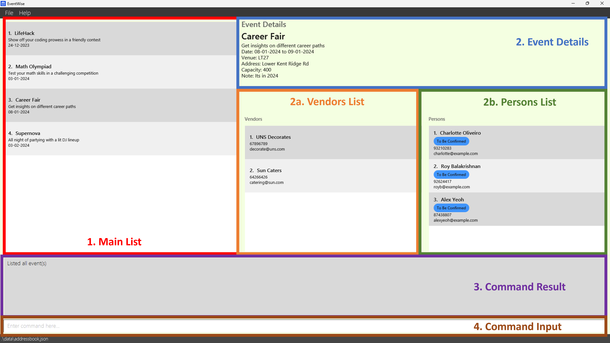
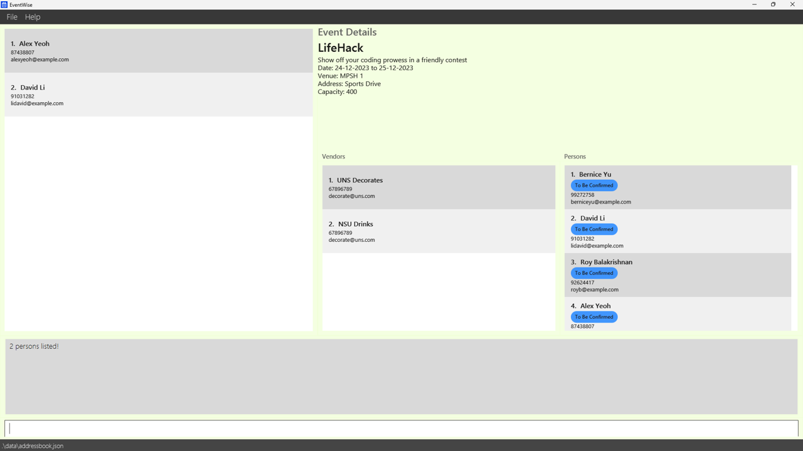
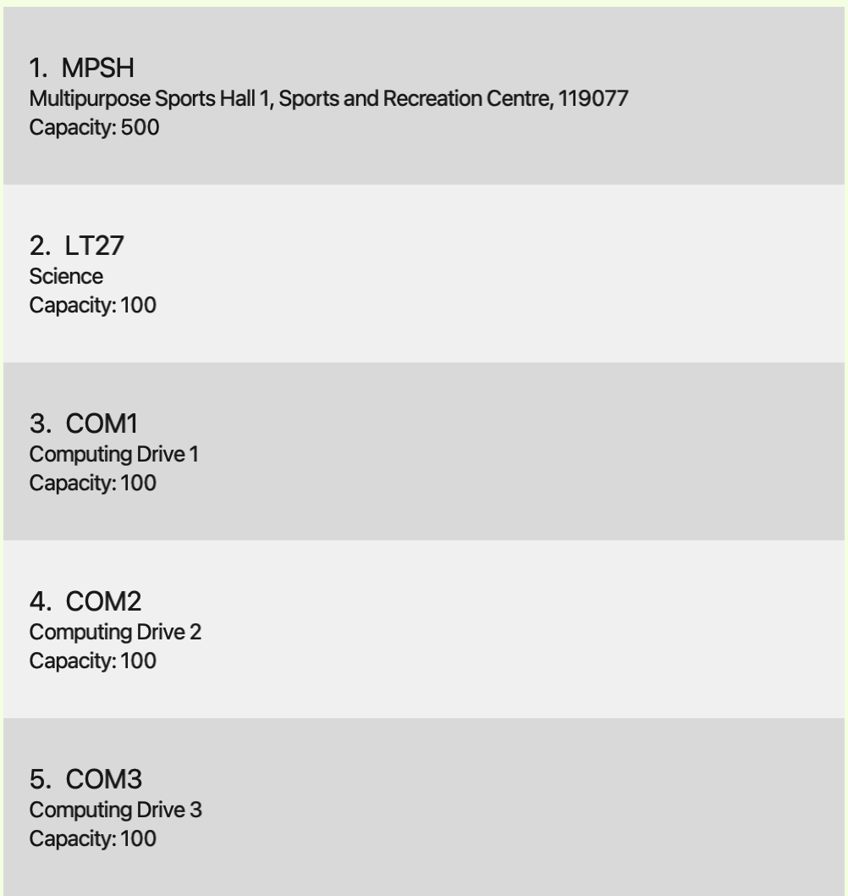
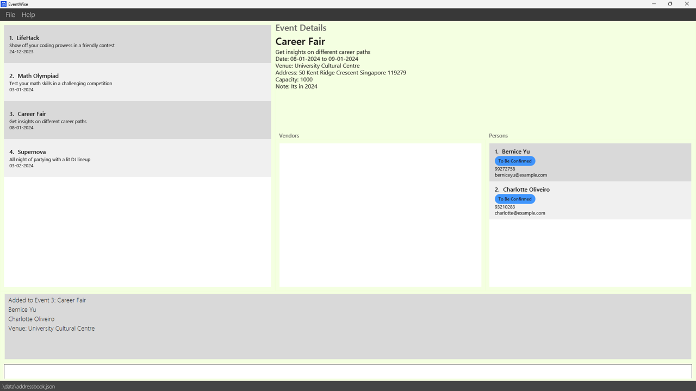
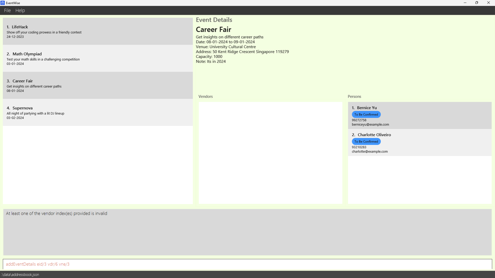
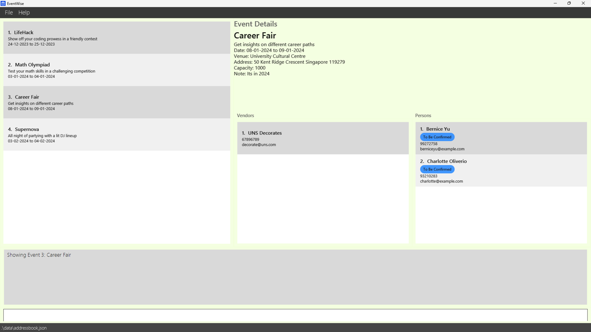
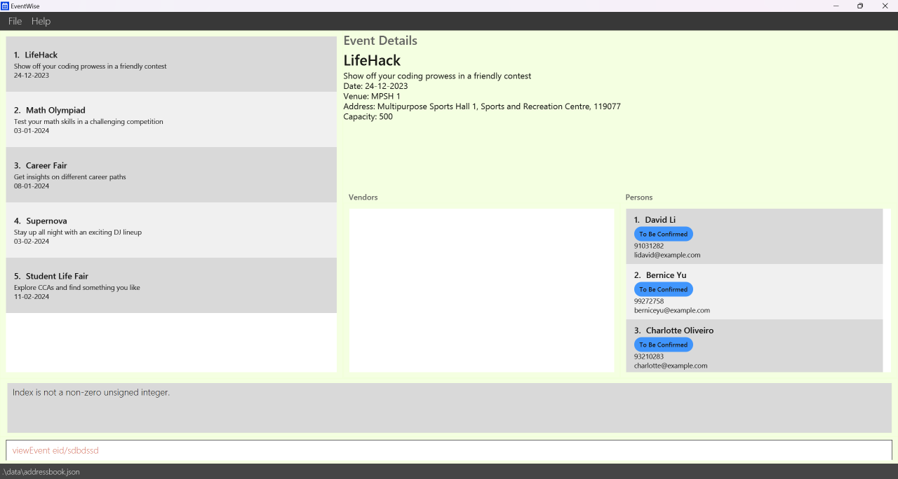
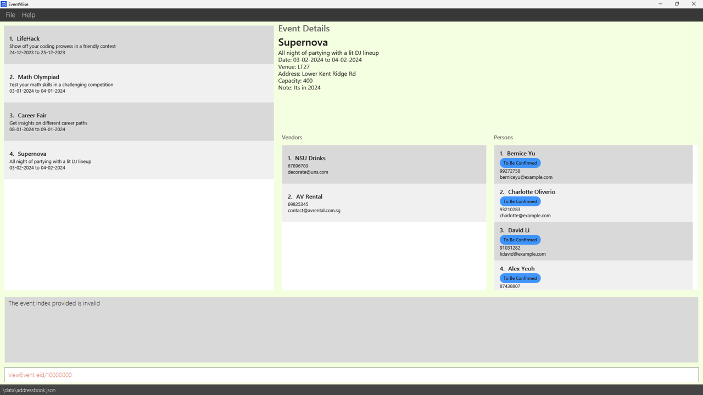
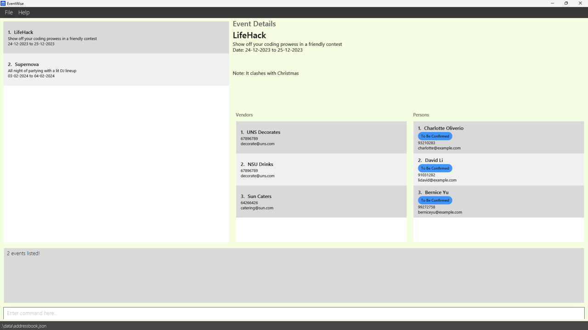

**EventWise** provides a platform that allows all event-specific contacts, including management, attendees, vendors, 
and venue details to be consolidated in one place. It allows event planners to easily track and access their crucial 
information in a single app, simplifying event coordination and communication for various kinds of events.

* Table of Contents
{:toc}

--------------------------------------------------------------------------------------------------------------------

## Quick start

1. Ensure you have Java `11` or above installed in your Computer.

1. Download the latest `EventWise.jar` from [here](https://github.com/AY2324S1-CS2103-F13-3/tp/releases/).

1. Copy the file to the folder you want to use as the _home folder_ for EventWise.

1. Open a command terminal, `cd` into the folder you put the jar file in, and use the `java -jar EventWise.jar` 
   command to run the application.<br>
   A GUI similar to the below should appear in a few seconds. Note how the app contains some sample data.<br>
   

1. Type the command in the command box and press Enter to execute it. e.g. typing **`help`** and pressing Enter will 
   open the help window.<br>
   Some example commands you can try:

   * `event n/PE Dry Run d/Dry run for CS2103 PE from/04-11-2024 to/05-11-2024`
   * `viewEvent eid/1`

1. Refer to the [Features](#features) below for details of each command.

--------------------------------------------------------------------------------------------------------------------
## User Interface Components
This section defines and explains the components used in EventWise's UI. 

### 1. Main List
The Main List serves as the primary view to display a range of data types within the application which includes events, 
persons, vendors and venues. It provides users with an organized view of various items and facilitates interaction with 
the displayed content.

### 2. Event Details
The Event Details component provides users with in-depth information about a specific event from the Main List such as 
description, from date, to date and venue information.

#### 2a. Person List
Displays a list of persons associated with the event.

#### 2b. Vendor List
Displays a list of vendors associated with the event.

### 3. Command Result
The Command Result component displays the outcome or feedback of the requested action. It may display success messages, 
error notifications or other relevant information

### 4. Command Input
This is where the user interacts with the application by providing a specific command.

--------------------------------------------------------------------------------------------------------------------

## Features

<div markdown="block" class="alert alert-info">

**:information_source: Notes about the command format:**<br>

* Words in `UPPER_CASE` are the parameters to be supplied by the user.<br>
  e.g. in `add n/NAME`, `NAME` is a parameter which can be used as `add n/John Doe`.

* Items in square brackets are optional.<br>
  e.g `eid/EVENT_ID [pid/INDEX]` can be used as `eid/1 pid/1` or as `eid/1`.

* Parameters can be in any order.<br>
  e.g. if the command specifies `n/NAME p/PHONE_NUMBER`, `p/PHONE_NUMBER n/NAME` is also acceptable.

* Extraneous parameters for commands that do not take in parameters will be ignored.<br>
  Commands include `list`, `viewVendors`, `viewVenues`, `viewEvents`, `clear`, `clearEvents`, `clearGuests`, `clearVenues`, `clearVendors`, `exit`, `help`.
  e.g. if the command specifies `help 123`, it will be interpreted as `help`.

* If you are using a PDF version of this document, be careful when copying and pasting commands that span multiple lines as space characters surrounding line-breaks may be omitted when copied over to the application.
</div>

## Guest Features

### Adding a person: `add`

Adds a person, with person name, phone number and email to EventWise.

Format: `add n/NAME p/PHONE_NUMBER e/EMAIL`

* The adding of a person is **case-sensitive**. e.g `John` will not be the same as `john`

Examples:
* `add n/John Doe p/98765432 e/johnd@example.com`
* `add n/Betsy Crowe e/betsycrowe@example.com p/1234567`

### Listing all persons : `list`

Shows a list of all persons in EventWise.

Format: `list`

**Command Behavior**
* Extraneous parameters will be ignored.
* e.g. if the command specifies `list 1`, it will be interpreted as `list`.

### Editing a person : `edit`

Edits an existing person in EventWise.

Format: `edit INDEX [n/NAME] [p/PHONE] [e/EMAIL]`

* Edits the person at the specified `INDEX`. The index refers to the index number shown in the displayed person list. 
  The index **must be a positive integer** 1, 2, 3, …​
* At least one of the optional fields must be provided.
* Existing values will be updated to the input values.

Examples:
* `edit 1 p/91234567 e/johndoe@example.com` Edits the phone number and email address of the 1st person to be `91234567`
   and `johndoe@example.com` respectively.
* `edit 2 n/Betsy Crower` Edits the name of the 2nd person to be `Betsy Crower`.

### Locating persons by name: `find`

Finds persons whose names contain any of the given keywords.

Format: `find KEYWORD [MORE_KEYWORDS]`

* The search is **case-insensitive**. e.g `hans` will match `Hans`
* The order of the keywords does not matter. e.g. `Hans Bo` will match `Bo Hans`
* Only the name is searched.
* Only full words will be matched e.g. `Han` will not match `Hans`
* Persons matching at least one keyword will be returned (i.e. `OR` search).
  e.g. `Hans Bo` will return `Hans Gruber`, `Bo Yang`

Examples:
* `find John` returns `john` and `John Doe`
* `find alex david` returns `Alex Yeoh`, `David Li`<br>
  

### Deleting a person : `delete`

Deletes the specified person from the persons list in EventWise.

Format: `delete INDEX`

* Deletes the person at the specified `INDEX`.
* The index refers to the index number shown in the displayed person list.
* The index **must be a positive integer** 1, 2, 3, …​

Examples:
* `list` followed by `delete 2` deletes the 2nd person in EventWise.
* `find Betsy` followed by `delete 1` deletes the 1st person in the results of the `find` command.

## Vendor Features

### Adding a vendor: `vendor`

Adds a vendor, with vendor name, phone number and email to EventWise.

Format: `vendor n/NAME p/PHONE e/EMAIL`
* The adding of a vendor is **case-sensitive**. e.g `Sun Catering` will not be the same as `SUN Catering`

Examples:
* `vendor n/Catering p/64646262 e/catering@gmail.com`

**Expected Command Result**
```
Venue 1: Catering, 64646262, catering@gmail.com has been successfully added.
```

**Invalid Command Results**
```
Create Vendor Failed: Vendor name cannot be empty.
```
```
Create Vendor Failed: Vendor phone number cannot be empty.
```
```
Create Vendor Failed: Vendor email cannot be empty.
```
```
Create Venue Failed: Invalid phone number.
```
```
Create Venue Failed: Invalid email.
```

### Listing all vendors: `viewVendors`

Shows a list of all vendors in EventWise.

Format: `viewVendors`

**Command Behavior**
* Extraneous parameters will be ignored.
* e.g. if the command specifies `viewVendors 1`, it will be interpreted as `viewVendors`.

**Expected Command Result**


### Editing a vendor: `editVendor`

Edits an existing vendor in EventWise.

Format: `editVendor vdr/VENDOR_ID [n/NAME] [p/PHONE] [e/EMAIL]`

**Command Behavior**
* At least one of the optional fields must be provided.

Examples:
* `editVendor vdr/1 n/Good Food Catering`
* `editVendor vdr/1 e/gfcatering@gmail.com`

**Expected Command Result**
```
Vendor 1: Catering - Name changed to Good Food Catering.
```
```
Vendor 1: Good Food Catering - Email changed to gfcatering@gmail.com.
```

**Invalid Command Results**
```
Edit Vendor Failed: Vendor ID does not exist.
```
```
Edit Vendor Failed: No parameters provided.
```

### Deleting a vendor : `deleteVendor`

Deletes the specified vendor from the vendors list in EventWise.

Format: `deleteVendor vdr/VENDOR_ID`

**Command Behavior**
* Deletes the vendor at the specified `VENDOR_ID` from the vendor list.
* The Vendor ID refers to the index number shown in the displayed vendor list.
* The Vendor ID **must be a positive integer** 1, 2, 3, …​

Examples:
* `viewVendors` followed by `deleteVendor vdr/2` deletes the 2nd vendor in the vendor list.

**Expected Command Result**
```
Vendor 2: Good Food Catering has been successfully deleted
```

**Invalid Command Results**
```
Delete Vendor Failed: Invalid Vendor ID.
```
```
Delete Vendor Failed: Vendor ID does not exist.
```

## Venue Features

### Adding a venue: `venue`

Adds a venue, with venue name, address and capacity to EventWise.

Format: `venue n/NAME a/ADDRESS c/CAPACITY`
* The adding of a venue is **case-sensitive**. e.g `LT27` will not be the same as `Lt27`

Examples:
* `venue n/LT27 a/Lower Kent Ridge Road c/400`

**Expected Command Result**
```
Venue 1: LT27, Lower Kent Ridge Road, Capacity: 400 has been successfully added.
```

**Invalid Command Results**
```
Create Venue Failed: Venue name cannot be empty.
```
```
Create Venue Failed: Venue address cannot be empty.
```
```
Create Venue Failed: Venue capacity cannot be empty.
```
```
Create Venue Failed: Invalid capacity value.
```

### Listing all venues: `viewVenues`

Shows a list of all venues in EventWise.

Format: `viewVenues`

**Command Behavior**
* Extraneous parameters will be ignored.
* e.g. if the command specifies `viewVenues 1`, it will be interpreted as `viewVenues`.

**Expected Command Result**


### Editing a venue: `editVenue`

Edits an existing venue in EventWise.

Format: `editVenue vne/VENUE_ID [n/NAME] [a/ADDRESS] [c/CAPACITY]`

**Command Behavior**
* At least one of the optional fields must be provided.

Examples:
* `editVenue vne/1 n/MPSH2`
* `editVenue vne/1 c/300`

**Expected Command Result**
```
Venue 1: MPSH - Name changed to MPSH2.
```
```
Venue 1: MPSH2 - Capacity changed to 300.
```

**Invalid Command Results**
```
Edit Venue Failed: Venue ID does not exist.
```
```
Edit Venue Failed: No parameters provided.
```

### Deleting a venue : `deleteVenue`

Deletes the specified venue from the venues list in EventWise.

Format: `deleteVenue vne/VENUE_ID`

**Command Behavior**
* Deletes the venue at the specified `VENUE_ID` from the venue list.
* The Venue ID refers to the index number shown in the displayed venue list.
* The Venue ID **must be a positive integer** 1, 2, 3, …​

Examples:
* `viewVenues` followed by `deleteVenue vne/2` deletes the 2nd venue in the venue list.

**Expected Command Result**
```
Venue 2: MPSH has been successfully deleted
```

**Invalid Command Results**
```
Delete Venue Failed: Invalid Venue ID.
```
Delete Venue Failed: Venue ID does not exist.


## Event Features

### Adding an event: `event`

Adds an event, with event name, description, from date, to date and note (optional) to EventWise.

Format: `event n/NAME d/DESC from/DT to/DT [no/NOTE]`
* The adding of an event is **case-sensitive**. e.g `FSC` will not be the same as `Fsc`

Examples:
* `event n/FSC 2023 d/Freshman Social Camp 2023 from/10-12-2023 to/11-12-2023 no/Food and drinks are provided`
* `event n/FOC 2023 d/Freshman Orientation Camp 2023 from/04-12-2023 to/05-12-2023`

**Expected Command Result**
```
Event 1: FSC 2023 has been successfully added.
```
```
Event 2: FOC 2023 has been successfully added.
```

**Invalid Command Results**
```
Create Event Failed: Event name cannot be empty.
```
```
Create Event Failed: Event description cannot be empty.
```
```
Create Event Failed: Event from date has to be in DD-MM-YYYY format.
```
```
Create Event Failed: Event to date has after from date.
```

### Adding details to an event: `addEventDetails`

Adds event details such as venue, guests and vendors to a specified event in EventWise.

Format: `addEventDetails eid/EVENT_ID [pid/INDEX] [vne/VENUE_ID] [vdr/VENDOR_ID]`

**What each optional field does for a specified event**
* `[pid/INDEX]`: Adds the person at the specified `INDEX` in persons list as a guest of the event.
* `[vne/VENUE_ID]`: Sets the venue at the specified `VENUE_ID` in venues list as the venue of the event.
* `[vdr/VENDOR_ID]`: Adds the vendor at the specified `VENDOR_ID` in vendors list as a vendor of the event.

**Command Behavior**
* Adds details such as venue, guests and vendors for the event at the specified `EVENT_ID`.
  The index refers to the index number shown in the displayed person list. 
  The index **must be a positive integer** 1, 2, 3, …​
* At least one of the optional fields must be provided.
* The optional fields `[pid/INDEX]` and `[vdr/VENDOR_ID]` can be repeated more than once to add multiple people or vendors.

Examples:
* `viewEvent eid/3` followed by `addEventDetails eid/3 pid/2` adds the 2nd person in the address book to 3rd event in the event list
* `viewEvent eid/3` followed by `addEventDetails eid/3 pid/2 pid/3 vne/3` 
  * adds the 2nd and 3rd person in the address book to 3rd event in the event list 
  * sets the 3rd venue in the venue list as the venue for the 3rd event in the event list.
* `viewEvent eid/3` followed by `addEventDetails eid/1 pid/1 vdr/2 vne/3` 
  * adds the 1st person in the address book to the 1st event in the event list 
  * adds the 2nd vendor in the address book to the 1st event in the event list
  * sets the 3rd venue in the venue list as the venue for the 1st event in the event list.

**Expected Command Result**


**Invalid Command Results**


### Listing all events: `viewEvents`

Shows a list of all events in EventWise.

Format: `viewEvents`

**Command Behavior**
* Extraneous parameters will be ignored.
* e.g. if the command specifies `viewEvents 1`, it will be interpreted as `viewEvents`.

**Expected Command Result**


### Displaying details for an event: `viewEvent`

Displays all details for a specified event.

Format: `viewEvent eid/EVENT_ID`

**Event details to be displayed**
- Event Name
- Description
- From Date 
- To Date
- Note (if present)
- Venue Name
- Guest List
- Vendor List

* Displays the details for the event at the specified `EVENT_ID` from the event list. 
  The Event ID refers to the index number shown in the displayed event list. 
  The Event ID **must be a positive integer** 1, 2, 3, …​

Examples:
* `viewEvents` followed by `viewEvent eid/3` shows the details of the 3rd event in the events list.

**Expected Command Result**


**Invalid Command Results**

Non Integer Index: 

`viewEvent eid/afdefdfe`



Invalid Index: 

`viewEvent eid/10000000`



### Editing details of an event: `editEvent`

Edits an existing event in EventWise.

Format: `editEvent eid/ID [n/NAME] [d/DESC] [from/DT] [to/DT]`

**Command Behavior**
* At least one of the optional fields must be provided.

Examples:
* `editEvent eid/1 n/FSC 2024`
* `editEvent eid/1 d/Freshman Orientation Camp 2024`

**Expected Command Result**
```
Event 1: FSC 2023 - Name changed to FSC 2024.
```
```
Event 1: FSC 2024 - Description changed to Freshman Orientation Camp 2024.
```

**Invalid Command Results**
```
Edit Event Failed: Event ID does not exist.
```
```
Edit Event Failed: No parameters provided.
```

### Delete Event : `deleteEvent`

Deletes the specified event from the events list in EventWise.

Format: `deleteEvent eid/EVENT_ID`

* Deletes the event at the specified `EVENT_ID` from the event list. 
  The Event ID refers to the index number shown in the displayed event list.
  The Event ID **must be a positive integer** 1, 2, 3, …​

Examples:
* `viewEvents` followed by `deleteEvent eid/2` deletes the 2nd event in the events list.

**Expected Command Result**
```
Event 2: FOC, Freshman Orientation Camp has been successfully deleted
```

**Invalid Command Results**
```
Delete Event Failed: Invalid Event ID.
```
```
Delete Event Failed: Event ID does not exist.
```

### Locating events by name: `findEvent`

Finds events whose names contain any of the given keywords.

Format: `findEvent KEYWORD [MORE_KEYWORDS]`

* The search is case-insensitive. e.g `caReer` will match `Career`
* The order of the keywords does not matter. e.g. `Sports Day` will match `Day Sports`
* Only the event name is searched.
* Only full words will be matched e.g. `Sport` will not match `Sports`
* Events matching at least one keyword will be returned (i.e. `OR` search).
  e.g. `Fair Day` will return `Career Fair`, `Sports Day`

Examples:
* `findEvent Fair` returns `Career Fair` and `Student Life Fair`
* `findEvent supernova lifeHack` returns `Supernova`, `LifeHack`<br>



### RSVP : `rsvp`

Updates RSVP status of a person for a specific event.

Format: `rsvp eid/EVENT_ID pid/PERSON_ID s/STATUS`

* Set the RSVP status of the specified `EVENT_ID` and `PERSON_ID` to the new RSVP status.
* The Event ID refers to the index number shown in the displayed event list.
* The Person ID refers to the index number shown in the displayed person list.
* `CC` means the guest is **Confirm Coming**
* `CCC` means the guest is **Confirm Not Coming**
* `TBC` means the guest's attendance is **To Be Confirmed**

Examples:
* `rsvp eid/1 pid/1 s/CC`
* `rsvp eid/2 pid/2 s/CCC`

**Expected Command Result**
```
RSVP status has been updated: FSC 2023, John Doe, Confirm Coming
```

**Invalid Command Results**
```
Event or Person does not exist!
```
```
Value of RSVP Status can only be CC, CCC or TBC.
```
```
John Doe 2 has not been added to FSC 2023!
```

### Removing a person from an event: `removePerson`

Removes a person from a specified event

Format: `removePerson eid/EVENT_ID pid/PERSON_INDEX`
- The Event ID refers to the index number displayed in Main List
  - To view all events, type the `viewEvents` command.
- The Person ID refers to the index number displayed in the Persons List that is associated to the event.

Examples:
- `viewEvent eid/4` followed by `removePerson eid/4 pid/1` deletes the 1st person in the person list associated with the 4th event.

**Expected Command Result**


**Invalid Command Results**


### Removing a vendor from an event: `removeVendor`

Removes a vendor from a specified event

Format: `removeVendor eid/EVENT_ID vdr/VENDOR_ID`
- The Event ID refers to the index number displayed in Main List
  - To view all events, type the `viewEvents` command.
- The Vendor ID refers to the index number displayed in the Vendors List that is associated to the event.

Examples:
- `viewEvent eid/2` followed by `removeVendor eid/2 vdr/2` deletes the 2nd vendor in the vendor list associated with the 2nd event.

**Expected Command Result**


**Invalid Command Results**


## General Features

### Viewing help : `help`

Shows a message explaining how to access the help page.


Format: `help`

**Command Behavior**
* Extraneous parameters will be ignored.
* e.g. if the command specifies `help 1`, it will be interpreted as `help`.

### Clearing all entries : `clear`

Clears all entries from EventWise.

Format: `clear`

**Command Behavior**
* Extraneous parameters will be ignored.
* e.g. if the command specifies `clear 1`, it will be interpreted as `clear`.

### Clearing all event entries : `clearEvents`

Clears all event entries from EventWise.

Format: `clearEvents`

**Command Behavior**
* Extraneous parameters will be ignored.
* e.g. if the command specifies `clearEvents 1`, it will be interpreted as `clearEvents`.

### Clearing all guest entries : `clearGuests`

Clears all guest entries from EventWise.

Format: `clearGuests`

**Command Behavior**
* Extraneous parameters will be ignored.
* e.g. if the command specifies `clearGuests 1`, it will be interpreted as `clearGuests`.

### Clearing all venue entries : `clearVenues`

Clears all venues from EventWise.

Format: `clearVenues`

**Command Behavior**
* Extraneous parameters will be ignored.
* e.g. if the command specifies `clearVenues 1`, it will be interpreted as `clearVenues`.

### Clearing all vendor entries : `clearVendors`

Clears all vendors from EventWise.

Format: `clearVendors`

**Command Behavior**
* Extraneous parameters will be ignored.
* e.g. if the command specifies `clearVendors 1`, it will be interpreted as `clearVendors`.

### Saving the data

EventWise data are saved in the hard disk automatically after any command that changes the data. There is no need to save manually.

### Editing the data file

EventWise data are saved automatically as a JSON file `[JAR file location]/data/eventwise.json`. 
Advanced users are welcome to update data directly by editing that data file.

<div markdown="span" class="alert alert-warning">:exclamation: **Caution:**
If your changes to the data file makes its format invalid, AddressBook will discard all data and start with an empty data file at the next run. Hence, it is recommended to take a backup of the file before editing it.
</div>

--------------------------------------------------------------------------------------------------------------------

## FAQ

**Q**: How do I transfer my data to another Computer?<br>
**A**: Install the app in the other computer and overwrite the empty data file it creates with the file that contains the data of your previous AddressBook home folder.

--------------------------------------------------------------------------------------------------------------------

## Known issues

1. **When using multiple screens**, if you move the application to a secondary screen, and later switch to using only the primary screen, the GUI will open off-screen. The remedy is to delete the `preferences.json` file created by the application before running the application again.

--------------------------------------------------------------------------------------------------------------------

## Command summary
### Guest Command summary

| Action     | Format                                           | Examples                                          |
|------------|--------------------------------------------------|---------------------------------------------------|
| **Add**    | `add n/NAME p/PHONE_NUMBER e/EMAIL`              | `add n/James Ho p/22224444 e/jamesho@example.com` |
| **Delete** | `delete INDEX`                                   | `delete 3`                                        |
| **Edit**   | `edit INDEX [n/NAME] [p/PHONE_NUMBER] [e/EMAIL]` | `edit 2 n/James Lee e/jameslee@example.com`       |
| **Find**   | `find KEYWORD [MORE_KEYWORDS]`                   | `find James Jake`                                 |
| **List**   | `list`                                           |                                                   |

### Vendor Command summary

| Action            | Format                                                  | Examples                                              |
|-------------------|---------------------------------------------------------|-------------------------------------------------------|
| **Create Vendor** | `vendor n/NAME p/PHONE e/EMAIL`                         | `vendor n/SUN Catering p/64646767 e/catering@sun.com` |
| **Edit Vendor**   | `editVendor vdr/VENDOR_ID [n/NAME] [p/PHONE] [e/EMAIL]` | `editVendor vdr/1 n/SUN Catering`                     |
| **Delete Vendor** | `deleteVendor vdr/VENDOR_ID`                            | `deleteVendor vdr/1`                                  |
| **View Vendors**  | `viewVendors`                                           |                                                       |

### Venue Command summary

| Action           | Format                                                     | Examples                                      |
|------------------|------------------------------------------------------------|-----------------------------------------------|
| **Create Venue** | `venue n/NAME a/ADDRESS c/CAPACITY`                        | `venue n/LT 27 a/Lower Kent Ridge Road c/400` |
| **Edit Venues**  | `editVenue vne/VENUE_ID [n/NAME] [a/ADDRESS] [c/CAPACITY]` | `editVenue vne/1 n/MPSH 2`                    |
| **Delete Venue** | `deleteVenue vne/VENUE_ID`                                 | `deleteVenue vne/2`                           |
| **View Venues**  | `viewVenues`                                               |                                               |

### Event Command summary

| Action                       | Format                                                                    | Examples                                                                     |
|------------------------------|---------------------------------------------------------------------------|------------------------------------------------------------------------------|
| **Add Event**                | `event n/NAME d/DESC from/DATE to/DATE`                                   | `event n/FSC 2023 d/Freshman Social Camp 2023 from/12-12-2023 to/13-12-2023` |
| **Add Event Details**        | `addEventDetails eid/EVENT_ID [pid/INDEX] [vne/VENUE_ID] [vdr/VENDOR_ID]` | `addEventDetails eid/3 pid/2`                                                |
| **Remove Person from Event** | `removePerson eid/EVENT_ID pid/PERSON_INDEX`                              | `removePerson eid/1 pid/1`                                                   |
| **Remove Vendor from Event** | `removeVendor eid/EVENT_ID vdr/VENDOR_ID`                              | `removeVendor eid/1 vdr/1`                                                   |
| **Delete Event**             | `deleteEvent eid/EVENT_ID`                                                | `deleteEvent eid/1`                                                          |
| **Edit Event**               | `editEvent eid/ID [n/NAME] [d/DESC] [from/DATE] [to/DATE]`                | `editEvent eid/1 d/Freshman Orientation Camp 2024`                           |
| **View Event**               | `viewEvent eid/ID`                                                        | `viewEvent eid/1`                                                            |
| **View All Events**          | `viewEvents`                                                              |                                                                              |
| **RSVP**                     | `rsvp eid/EVENT_ID pid/PERSON_ID s/STATUS`                                | `rsvp eid/1 pid/1 s/CC`                                                      |

### General Command summary

| Action            | Format         | Examples |
|-------------------|----------------|----------|
| **Clear All**     | `clear`        |          |
| **Clear Events**  | `clearEvents`  |          |
| **Clear Guests**  | `clearGuests`  |          |
| **Clear Venues**  | `clearVenues`  |          |
| **Clear Vendors** | `clearVendors` |          |
| **Help**          | `help`         |          |
