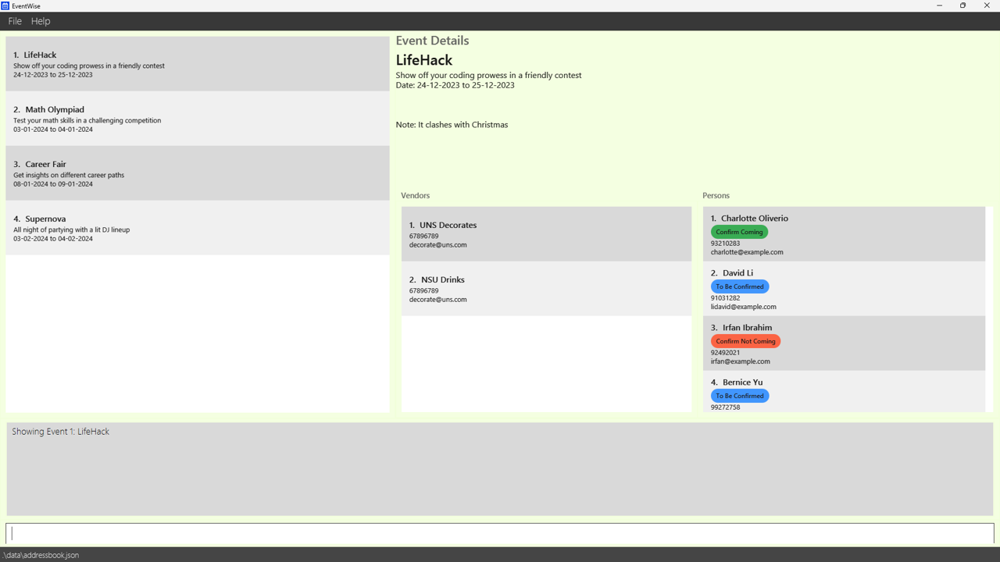
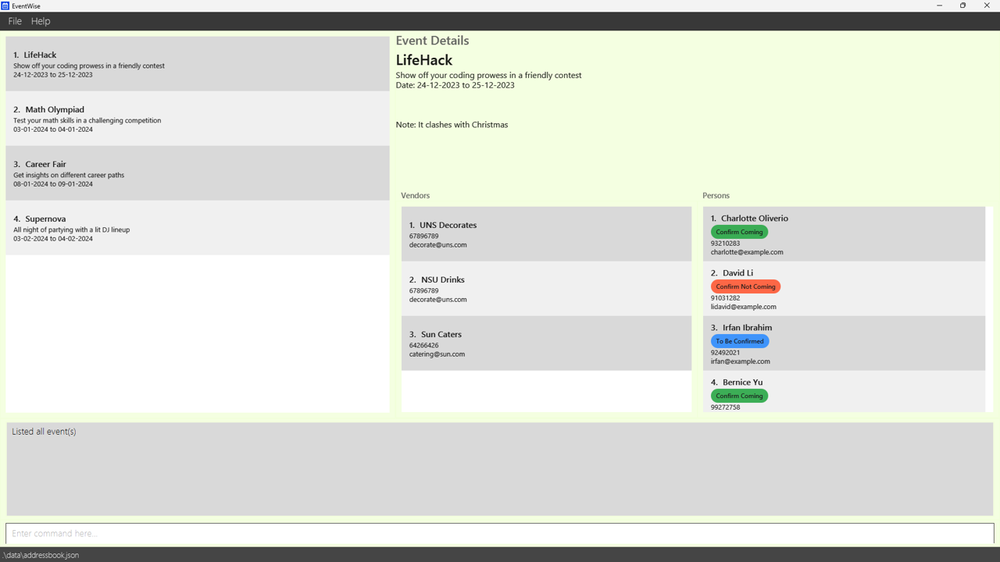

**EventWise** provides a platform that allows all event-specific contacts, including management, attendees, vendors, and venue details to be consolidated in one place. It allows event planners to easily track and access their crucial information in a single app, simplifying event coordination and communication for various kinds of events.

* Table of Contents
{:toc}

--------------------------------------------------------------------------------------------------------------------

## Quick start

1. Ensure you have Java `11` or above installed in your Computer.

1. Download the latest `EventWise.jar` from TBA.

1. Copy the file to the folder you want to use as the _home folder_ for your AddressBook.

1. Open a command terminal, `cd` into the folder you put the jar file in, and use the `java -jar EventWise.jar` command to run the application.<br>
   A GUI similar to the below should appear in a few seconds. Note how the app contains some sample data.<br>
   

1. Type the command in the command box and press Enter to execute it. e.g. typing **`help`** and pressing Enter will open the help window.<br>
   Some example commands you can try:

   * `To be added.`

1. Refer to the [Features](#features) below for details of each command.

--------------------------------------------------------------------------------------------------------------------

## Features

<div markdown="block" class="alert alert-info">

**:information_source: Notes about the command format:**<br>

* Words in `UPPER_CASE` are the parameters to be supplied by the user.<br>
  e.g. in `add n/NAME`, `NAME` is a parameter which can be used as `add n/John Doe`.

* Items in square brackets are optional.<br>
  e.g `n/NAME [t/TAG]` can be used as `n/John Doe t/friend` or as `n/John Doe`.

* Items with `…`​ after them can be used multiple times including zero times.<br>
  e.g. `[t/TAG]…​` can be used as ` ` (i.e. 0 times), `t/friend`, `t/friend t/family` etc.

* Parameters can be in any order.<br>
  e.g. if the command specifies `n/NAME p/PHONE_NUMBER`, `p/PHONE_NUMBER n/NAME` is also acceptable.

* Extraneous parameters for commands that do not take in parameters (such as `help`, `list`, `exit` and `clear`) will be ignored.<br>
  e.g. if the command specifies `help 123`, it will be interpreted as `help`.

* If you are using a PDF version of this document, be careful when copying and pasting commands that span multiple lines as space characters surrounding line-breaks may be omitted when copied over to the application.
</div>

### Create Event: `event`

This feature creates a new event object with the event name, description date and time and is stored into the event list.

Format: `event name/NAME desc/DESC dt/DT`

Examples:
* `event name/FSC 2023 desc/Freshman Social Camp 2023 dt/2023-10-04`
* `event name/FOC 2023 desc/Freshman Orientation Camp 2023 dt/2023-09-04`

**Expected Command Result**
```
Event 1: FSC 2023 has been successfully added.
```
```
Event 2: FOC 2023 has been successfully added.
```

**Invalid Command Results**
```
Create Event Failed: Event name cannot be empty.
```
```
Create Event Failed: Event description cannot be empty.
```
```
Create Event Failed: Event datetime has to be in YYYY-MM-DD format.
```

### Add Event Details: `addEventDetails`

Adds event details such as venue, guests and vendors to a specified event.

Format: `addEventDetails id/EVENT_ID [person/INDEX] [venue/VENUE_ID] [vendor/VENDOR_ID]`

**What each optional field does for a specified event**
* `[person/INDEX]`: Adds the person at the specified `INDEX` as a guest of the event.
* `[venue/VENUE_ID]`: Sets the venue at the specified `VENUE_ID` as the venue of the event.
* `[vendor/VENDOR_ID]`: Adds the vendor at the specified `VENDOR_ID` as part of the event. (coming in v1.3)

**Command Behavior**

* Adds details such as venue, guests and vendors for the event at the specified `EVENT_ID`.
* The index refers to the index number shown in the displayed person list.
* The index **must be a positive integer** 1, 2, 3, …​
* At least one of the optional fields must be provided.
* The optional fields `[person/INDEX]` and `[vendor/VENDOR_ID]` can be repeated more than once to add multiple people or vendors.

Examples:
* `viewEvent 3` followed by `addEventDetails 3 person/2` adds the 2nd person in the address book to 3rd event in the event list
* `viewEvent 3` followed by `addEventDetails 3 person/3 venue/2` adds the 3rd person in the address book and sets the 2nd venue in the venue list to 3rd event in the event list

**Expected Command Result**
```
Person 2: Bernice Yu has been successfully added to Event 3: FOC
```
```
Person 3: Charlotte Oliverio has been successfully added to Event 3: FOC
Venue 2: MPSH1 has beeen successfully set as the venue for Event 3: FOC
```

**Invalid Command Results**
```
Add Event Details Failed: Invalid Event ID.
```
```
Add Event Details Failed: Event ID does not exist.
```
```
Add Event Details Failed: Person does not exist.
```
```
Add Event Details Failed: Venue does not exist.
```

### View a list of Events: `viewEvents`

View all the events in a list.

**Expected Command Result**



### View Event Details: `viewEvent`

View details for a specified event.

Format: `viewEvents`

**Event details to be displayed**
- Event Name
- Description
- Date / Time
- Venue Name
- Guest List
- Vendor List (coming in v1.3)

Format: `viewEvent id/EVENT_ID`

* Displays the details for the event at the specified `EVENT_ID` from the event list.
* The Event ID refers to the index number shown in the displayed event list.
* The Event ID **must be a positive integer** 1, 2, 3, …​

Examples:
* `viewEvents` followed by `viewEvent 3` shows the details of the 3rd event in the event list.

**Expected Command Result**
```
Showing Event 3: FOC
```

**Invalid Command Results**
```
View Event Details Failed: Invalid Event ID format.
```
```
View Event Details Failed: Event ID does not exist.
```

### Edit Event: `editEvent`

This feature allows users to edit event details.

Format: `editEvent id/ID [name/NAME] [desc/DESC] [dt/DT]`

**Command Behavior**
* At least one of the optional fields must be provided.

Examples:
* `editEvent 1 name/FSC 2024`
* `editEvent 1 desc/Freshman Orientation Camp 2024`

**Expected Command Result**
```
Event 1: FSC 2023 - Name changed to FSC 2024.
```
```
Event 1: FSC 2024 - Description changed to Freshman Orientation Camp 2024.
```

**Invalid Command Results**
```
Edit Event Failed: Event ID does not exist.
```
```
Edit Event Failed: No parameters provided.
```

### Delete Event : `deleteEvent`

Deletes the specified event.

Format: `deleteEvent id/EVENT_ID`

* Deletes the event at the specified `EVENT_ID` from the event list.
* The Event ID refers to the index number shown in the displayed event list.
* The Event ID **must be a positive integer** 1, 2, 3, …​

Examples:
* `viewEvents` followed by `deleteEvent 2` deletes the 2nd event in the event list.

**Expected Command Result**
```
Event 2: FOC, Freshman Orientation Camp has been successfully deleted
```

**Invalid Command Results**
```
Delete Event Failed: Invalid Event ID.
```
Delete Event Failed: Event ID does not exist.

### Delete Event : `deleteEvent`
_Details coming soon ..._

### Create Venue: `venue`

This feature creates a new venue object with the venue name, address, capacity, and is stored into the venue list.

Format: `venue name/<name> addr/<address> cap/<capacity>`

Examples:
* `venue name/LT 27 addr/Lower Kent Ridge Road cap/400`

**Expected Command Result**
```
Venue 1: LT27, Lower Kent Ridge Road, Capacity: 400 has been successfully added.
```

**Invalid Command Results**
```
Create Venue Failed: Venue name cannot be empty.
```
```
Create Venue Failed: Venue address cannot be empty.
```
```
Create Venue Failed: Venue capacity cannot be empty.
```
```
Create Venue Failed: Invalid capacity value.
```

### View a list of Events: `viewVenues`

View all the venues in a list.

**Expected Command Result**


### Saving the data

AddressBook data are saved in the hard disk automatically after any command that changes the data. There is no need to save manually.

### Editing the data file

AddressBook data are saved automatically as a JSON file `[JAR file location]/data/eventwise.json`. Advanced users are welcome to update data directly by editing that data file.

<div markdown="span" class="alert alert-warning">:exclamation: **Caution:**
If your changes to the data file makes its format invalid, AddressBook will discard all data and start with an empty data file at the next run. Hence, it is recommended to take a backup of the file before editing it.
</div>

### Archiving data files `[coming in v2.0]`

_Details coming soon ..._

--------------------------------------------------------------------------------------------------------------------

## FAQ

**Q**: How do I transfer my data to another Computer?<br>
**A**: Install the app in the other computer and overwrite the empty data file it creates with the file that contains the data of your previous AddressBook home folder.

--------------------------------------------------------------------------------------------------------------------

## Known issues

1. **When using multiple screens**, if you move the application to a secondary screen, and later switch to using only the primary screen, the GUI will open off-screen. The remedy is to delete the `preferences.json` file created by the application before running the application again.

--------------------------------------------------------------------------------------------------------------------

## Command summary

Action | Format, Examples
--------|------------------
**Add** | `add n/NAME p/PHONE_NUMBER e/EMAIL a/ADDRESS [t/TAG]…​` <br> e.g., `add n/James Ho p/22224444 e/jamesho@example.com a/123, Clementi Rd, 1234665 t/friend t/colleague`
**Clear** | `clear`
**Delete** | `delete INDEX`<br> e.g., `delete 3`
**Edit** | `edit INDEX [n/NAME] [p/PHONE_NUMBER] [e/EMAIL] [a/ADDRESS] [t/TAG]…​`<br> e.g.,`edit 2 n/James Lee e/jameslee@example.com`
**Find** | `find KEYWORD [MORE_KEYWORDS]`<br> e.g., `find James Jake`
**List** | `list`
**Help** | `help`
